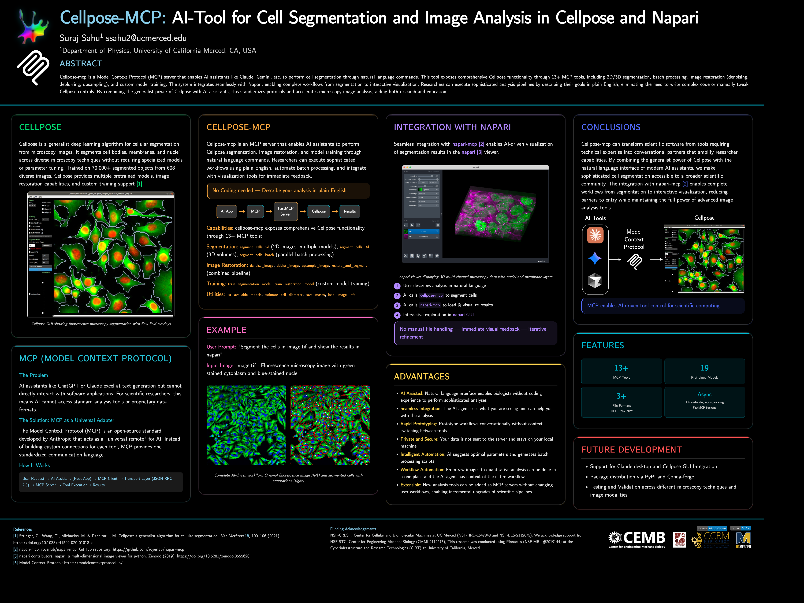
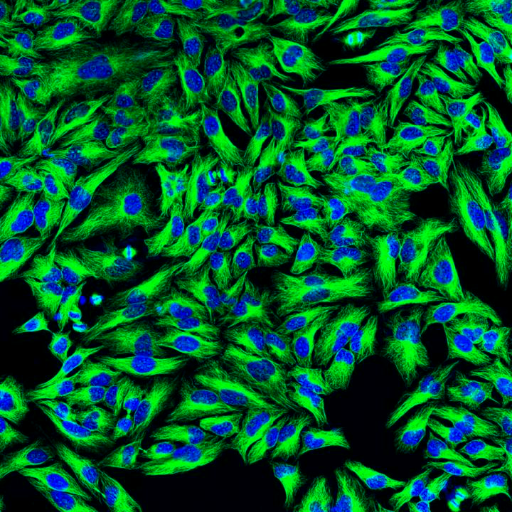
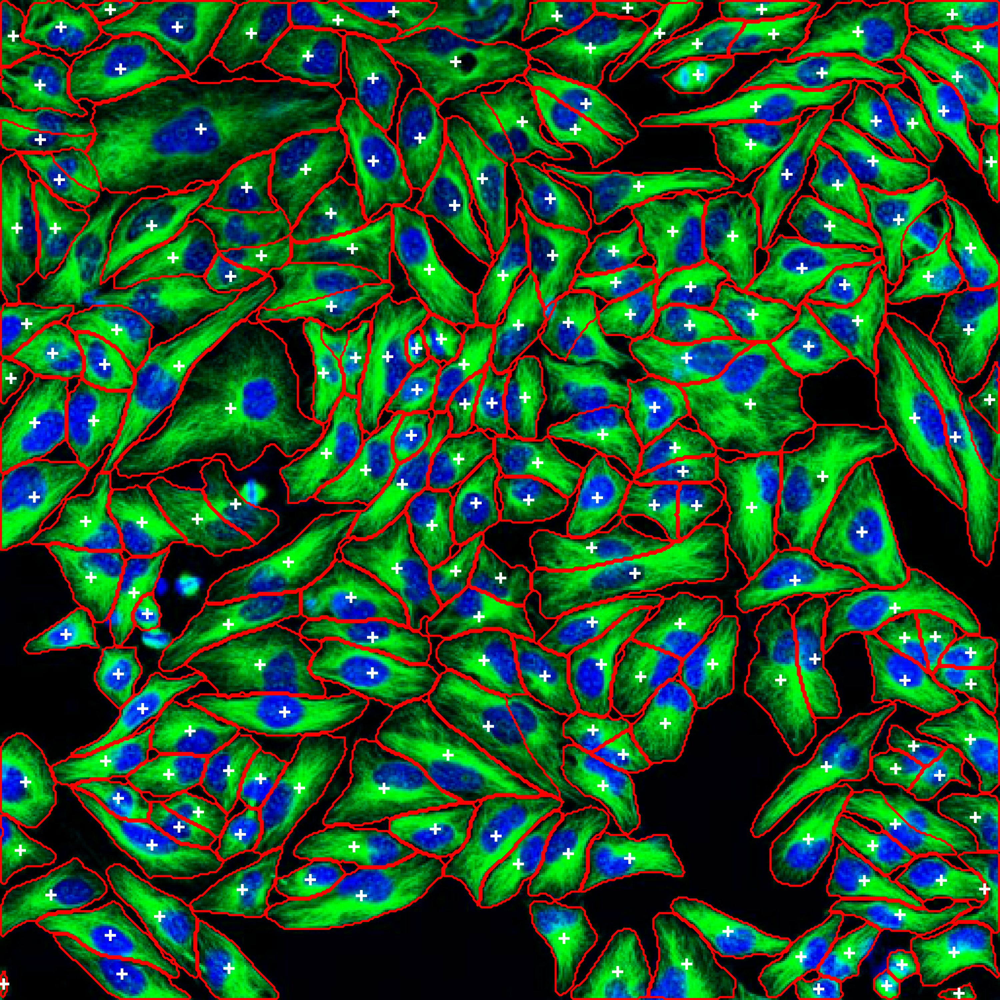

# Cellpose MCP Server

[](https://www.python.org/downloads/)
[](https://opensource.org/licenses/BSD-3-Clause)

Cellpose-mcp is a Model Context Protocol (MCP) server that enables AI assistants like Claude, Cursor IDE, etc. to perform cell segmentation through natural language commands. This tool exposes comprehensive Cellpose functionality through 25+ MCP tools, including 2D/3D segmentation, batch processing, image restoration (denoising, deblurring, upsampling), custom model training, pipeline documentation, verification, CellProfiler integration, and dynamic package management. The system integrates seamlessly with Napari and CellProfiler, enabling complete workflows from segmentation to interactive visualization and advanced analysis.





> **📌 Note**: This project started as a fun project inspired by [napari-mcp](https://github.com/royerlab/napari-mcp) and adapted for [Cellpose](https://github.com/MouseLand/cellpose) segmentation workflows. If you would like to contribute then please get in touch with me at [ssahu2@ucmerced.edu](mailto:ssahu2@ucmerced.edu).

### 🚀 Quick Start

```bash
pip install cellpose-mcp
```

**OR for development:**

```bash
git clone https://github.com/surajinacademia/cellpose_mcp.git
cd cellpose_mcp
pip install -e .
```

### Auto-Configure Your AI Application

| Application | Installation Command | Notes |
| ----------- | -------------------- | ----- |
| **Cursor IDE** | `cellpose-mcp-install cursor` | Auto-configures MCP settings |
| **Claude Desktop** | `cellpose-mcp-install claude-desktop` | Adds to Claude Desktop config |
| **Antigravity** | `cellpose-mcp-install antigravity` | Configures Antigravity MCP |
| **Claude Code** | `cellpose-mcp-install claude-code` | Or manually add `.mcp.json` to project root |
| **VS Code** | `cellpose-mcp-install vscode` | Configures Cline/Roo Cline extension |

<details>
<summary>Manual Configuration for Claude Code</summary>

If you prefer manual setup, create a `.mcp.json` file in your project root:

```json
{
  "mcpServers": {
    "cellpose": {
      "command": "python",
      "args": ["-m", "cellpose_mcp"],
      "env": {
        "KMP_DUPLICATE_LIB_OK": "TRUE",
        "OMP_NUM_THREADS": "1"
      }
    }
  }
}
```
</details>

After installation, restart your AI app and try asking:

```text
"Can you list available Cellpose models?"
"Segment the cells in ./data/sample.tif using the cyto2 model"
```

## 🎯 What Can You Do?

### Example: Cell Segmentation in Action

<table>
<tr>
<td width="50%">

<p align="center"><em>Original Image: Fluorescence microscopy with green-stained cytoplasm and blue-stained nuclei</em></p>
</td>
<td width="50%">

<p align="center"><em>Segmented Result: Cells automatically detected with boundaries and labels</em></p>
</td>
</tr>
</table>

### Basic Cell Segmentation

```text
"Segment the cells in ./data/sample.tif using the cyto2 model"
"List available Cellpose models"
"Estimate cell diameter from ./data/image.tif"
```

### Advanced Workflows

```text
"Segment all TIFF files in ./data/images/ and save masks to ./output/"
"Train a custom segmentation model using images in ./train/images/ and masks in ./train/masks/"
"Restore and segment the noisy image in ./data/noisy.tif using oneclick_cyto3"
```

### Batch Processing

```text
"Process all images in ./data/ with the cyto2 model and save results to ./output/"
```

### 🆕 Pipeline Documentation & Verification

```text
"Create a pipeline summary for my segmentation workflow"
"Verify the segmentation results in ./output/masks.tif against the original image"
"Save the pipeline memory for experiment_001"
"Load the analysis memory for experiment_001"
```

### 🆕 CellProfiler Integration

```text
"Run the CellProfiler pipeline ./analysis/pipeline.cppipe on images in ./data/"
"Import Cellpose masks from ./output/ into CellProfiler format"
"Check if CellProfiler is available"
```

### 🆕 Package Management

```text
"Install scikit-image package for additional image processing"
"Check if opencv-python is installed"
"List all allowed packages that can be installed"
```

## 🛠 Available MCP Tools

The server exposes 25+ tools for complete Cellpose functionality and workflow management:

### Segmentation Tools

- **`segment_cells_2d`** - Segment cells in 2D images
- **`segment_cells_3d`** - Segment cells in 3D volumes
- **`segment_cells_batch`** - Batch process multiple images

### Image Restoration Tools

- **`denoise_image`** - Denoise microscopy images
- **`deblur_image`** - Deblur microscopy images
- **`upsample_image`** - Upsample low-resolution images
- **`restore_and_segment`** - Combined restoration + segmentation

### Training Tools

- **`train_segmentation_model`** - Train custom segmentation model
- **`train_restoration_model`** - Train custom restoration model

### Utility Tools

- **`list_available_models`** - List all pretrained models
- **`estimate_cell_diameter`** - Estimate cell diameter from image
- **`save_masks`** - Save masks in various formats
- **`load_image_info`** - Get image metadata

### 🆕 Pipeline Skills & Documentation Tools

- **`create_pipeline_summary`** - Generate detailed summary document for analysis pipeline
- **`verify_segmentation_results`** - Verify and validate segmentation quality
- **`save_analysis_memory`** - Save pipeline execution memory for reproducibility
- **`load_analysis_memory`** - Load previously saved pipeline memory
- **`list_analysis_memories`** - List all saved pipeline executions

### 🆕 CellProfiler Integration Tools

- **`run_cellprofiler_pipeline`** - Execute CellProfiler pipelines for advanced analysis
- **`import_cellpose_to_cellprofiler`** - Import Cellpose masks to CellProfiler
- **`export_cellprofiler_measurements`** - Export CellProfiler measurements
- **`check_cellprofiler_available`** - Check CellProfiler installation status

### 🆕 Package Management Tools

- **`install_package`** - Install approved image processing packages
- **`list_installed_packages`** - List all installed Python packages
- **`check_package_installed`** - Check if a specific package is installed
- **`list_allowed_packages`** - Show whitelist of installable packages

## 📖 Documentation

- **[Quick Start Guide](#-quick-start)** - Get running in 3 steps
- **[Available Tools](#-available-mcp-tools)** - Complete tool list (25+ tools)
- **[Example Workflows](EXAMPLES.md)** - Detailed examples using new features
- **[Developer Guide](CLAUDE.md)** - Architecture and contribution guide

## 🎯 New Features Highlights

### Pipeline Documentation & Verification
- **Automatic Summary Generation**: Create detailed markdown reports of your analysis pipelines
- **Quality Verification**: Automated checks on segmentation results with metrics
- **Memory/Logging**: Save and reload pipeline configurations for reproducibility

### CellProfiler Integration
- **Bridge Tools**: Seamlessly connect Cellpose segmentation with CellProfiler measurements
- **Pipeline Execution**: Run CellProfiler pipelines directly from AI assistants
- **Measurement Export**: Extract and organize CellProfiler results

### Dynamic Package Management
- **On-Demand Installation**: Install approved image processing packages as needed
- **Security First**: Whitelist-based approach ensures safe package installation
- **18+ Approved Packages**: Including scikit-image, opencv-python, matplotlib, and more

See [EXAMPLES.md](EXAMPLES.md) for complete workflow examples.


## 📋 Architecture

- **FastMCP Server**: Handles MCP protocol communication
- **Cellpose Integration**: Manages model loading and segmentation operations
- **Tool Layer**: Exposes Cellpose functionality as MCP tools
- **File I/O**: Handles image reading, writing, and mask generation

Key features:

- **Thread-safe**: All operations are properly serialized
- **Non-blocking**: Async operations for better performance
- **Napari Integration**: Integration with Napari for visualization and analysis


**Author:** [Suraj Sahu](https://physics.ucmerced.edu/content/suraj-sahu)  
**Affiliation:** Department of Physics, University of California Merced, CA, USA  
**Email:** ssahu2@ucmerced.edu


## 📄 License

BSD-3-Clause License - see [LICENSE](LICENSE) file for details.


## 🙏 Acknowledgments

- **[Napari MCP](https://github.com/royerlab/napari-mcp)** by [royerlab](https://github.com/royerlab)
- [Cellpose team](https://github.com/MouseLand/cellpose) for the excellent segmentation library
- [FastMCP](https://github.com/jlowin/fastmcp) for the MCP framework
- [Anthropic](https://www.anthropic.com/) for Claude and MCP development
- [Model Context Protocol](https://modelcontextprotocol.io/) - Open standard for AI-tool integration

---
