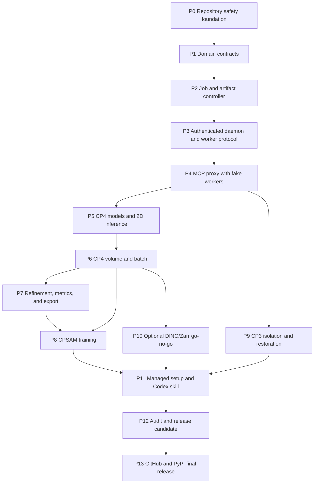

# Cellpose MCP Local-First Program Implementation Plan

> **For agentic workers:** REQUIRED SUB-SKILL: Use
> superpowers:subagent-driven-development (recommended) or
> superpowers:executing-plans to implement this plan task-by-task. Steps use
> checkbox (`- [ ]`) syntax for tracking.

**Goal:** Deliver `cellpose-mcp 0.2.0` as a locally verified, non-coder-friendly
Cellpose product for Codex Desktop, with every advertised workflow backed by
real installed-artifact evidence.

**Architecture:** MCP is the only assistant-facing API. A lightweight stdio
launcher proxies to an authenticated, persistent local controller, which owns
jobs, approved paths, models, and artifacts and supervises isolated CP4 and CP3
workers. A setup/doctor CLI installs and repairs the product, while a Codex
skill teaches safe workflows without containing implementation or authority;
there is no separate AI agent.

**Tech Stack:** Python 3.11/3.12, Python 3.12 controller, Python 3.12 +
Cellpose 4.2.1.1 worker, Python 3.11 + Cellpose 3.1.1.3 worker, FastMCP 3.x,
Pydantic 2, SQLite WAL, asyncio Unix sockets/socketpairs, uv lock files,
pytest/Hypothesis, Ruff, mypy, GitHub Actions, TestPyPI, PyPI.

## Global Constraints

- Initial supported platform is macOS 14 or later on Apple Silicon.
- Initial supported client is Codex Desktop.
- Public wheel compatibility is Python 3.11 and 3.12; the managed controller
  runs Python 3.12 and the managed CP3 worker runs Python 3.11.
- CP4 is exactly `4.2.1.1`; CP3 is exactly `3.1.1.3`.
- `cpsam_v2` is the default; `cpsam` is the other core CP4 built-in model.
- DINO and Zarr are absent unless their independent full gates pass.
- Inputs are immutable; every user workflow/result artifact write is beneath
  `<approved-root>/cellpose-results/<run-id>/`. Product administration,
  runtime state, models, logs, backups, LaunchAgent files, and Codex
  configuration use only the explicit application-support/configuration paths
  defined by the design.
- Workers are trusted same-user processes, not operating-system sandboxes.
- There is no telemetry, assistant-accessible general code execution,
  arbitrary package installation, arbitrary model URL, or
  assistant-controlled root approval. Hash-bound trusted local checkpoint
  import is an explicit CLI-only exception with a code-execution warning.
- All 13 workflow tools are release-blocking core surface.
- A feature-promotion change adds its manifest record, registration, schema,
  documentation, and evidence references atomically. That change cannot merge
  into the accepted release branch unless every reference resolves and passes;
  only accepted stable records project into release schemas and documentation.
- No stable release is made between internal gates.
- Existing modified and untracked work is preserved until a hashed inventory
  has been reviewed; no broad cleanup command is permitted.
- Implementation stays on `codex/cellpose-local-first`, and every commit stages
  exact paths only.

---

## 1. Locked product choice

The product is a coordinated MCP + CLI + skill:

| Component | Responsibility | Explicitly does not do |
| --- | --- | --- |
| MCP | Natural-language workflow tools and status polling | Install runtimes, approve roots, run shell code |
| Controller | Authority, validation, jobs, persistence, workers, artifacts | Import Cellpose |
| CP4 worker | Current segmentation, refinement, analysis, export, training | Restoration, root discovery, arbitrary paths |
| CP3 worker | Validated restoration workflows | General current segmentation API |
| CLI | Setup, doctor, status, update, automatic update rollback, uninstall, administrative consent | Behave as another AI agent |
| Codex skill | Teach safe workflow sequencing and interpretation | Own authority or implement Cellpose |

A standalone agent would duplicate assistant behavior and fragment security
policy. A standalone CLI would be too technical for the target user. A skill
alone cannot execute Cellpose or enforce safety. MCP therefore remains the
canonical product surface, supported by—not replaced by—the CLI and skill.

## 2. Planning and execution rule

This roadmap fixes subsystem boundaries, dependencies, evidence, and stop
conditions. Each phase gets a separate detailed TDD plan only after all of its
entry evidence exists. This is deliberate: CP4 and CP3 contract probes must
resolve their real signatures before request enums or worker adapters are
frozen.

Before changing production files for a phase:

1. Confirm the predecessor gate is green.
2. Write the named phase plan in `docs/superpowers/plans/`.
3. Include exact files, signatures, test bodies, commands, expected results,
   and narrow commit paths.
4. Review the plan against the approved design and the evidence produced by
   predecessor phases.
5. Execute it with fresh task agents and two-stage review, or inline with
   explicit checkpoints.

The first executable plan is
`docs/superpowers/plans/2026-07-16-cellpose-repository-foundation.md`.

## 3. Dependency graph

## 4. Phase sequence and hard gates

### Phase 0: Repository safety foundation

**Detailed plan:** `2026-07-16-cellpose-repository-foundation.md`

**Produces:**

- A tested, non-destructive worktree/index inventory with independent SHA-256
  evidence captured before existing project files change.
- Python/package policy and a locked development environment for Python 3.11
  and 3.12.
- A packaged bootstrap feature ledger that names all 13 tools, rejects stable
  records, and remains blocked on the unresolved capability matrix.
- A true source-distribution allowlist and clean-clone artifact test.
- Hunk-only staging proof for the already-dirty metadata and CI files.

**Exit gate:**

- Foundation tests pass on Python 3.11 and 3.12.
- The release-mode feature check fails for the unresolved matrix and all 13
  missing stable tools; no arbitrary evidence string can clear it.
- The worktree inventory exists under ignored `local_archive/`.
- A clean committed clone excludes untracked runtime modules and unrelated
  repository content from wheel/sdist artifacts.
- No current user file has been moved or deleted.

### Phase 1: Upstream probes, capability matrix, and domain contracts

**Detailed plan names:**

- `2026-07-16-cellpose-upstream-contract-probes.md`
- `2026-07-16-cellpose-domain-contracts.md`
- `2026-07-16-cellpose-image-inspection.md`

**Produces:**

- Minimal isolated probe environments locked to Python 3.12/Cellpose 4.2.1.1
  and Python 3.11/Cellpose 3.1.1.3 before any runtime-dependent enum freezes.
- Recorded constructor, inference, restoration, metrics, export, training,
  model-name, return-shape, and removed/inert legacy behavior.
- Feature-manifest schema version 2 with a required capability matrix keyed by
  granular feature ID, not merely one record per tool. The verifier resolves
  pytest nodes, documentation anchors, journey records, dependency locks,
  licenses, schemas, and registration.
- Stable opaque IDs, recursive finite JSON error details, structured public
  errors, `JobState`, tool operations, worker runtimes, devices, models, axes,
  resource bounds, consent, jobs, artifacts, provenance, and versioned worker
  envelopes.
- Descriptor-based approved-root opens with `O_NOFOLLOW`, input revalidation,
  exclusive run-directory allocation, and path/race branch coverage.
- `YX`, `YXC`, `CYX`, `ZYX`, `ZYXC`, and `ZCYX` image layouts.
- Ambiguous three-dimensional input as
  `AXIS_CONFIRMATION_REQUIRED`, never a guess.
- Controller-side `inspect_image` and immutable asset registration without
  importing either worker. Baseline inputs are TIFF, OME-TIFF, PNG, and JPEG
  (both `.jpg` and `.jpeg` extensions).
  ND2, NRRD, OME-Zarr, NumPy pickle input, and every unlisted format are
  rejected unless separately gated.
- Consent request/nonce contracts bound to action, model/hash, source, size,
  license, destination, expiry, and single use.
- A protocol version independent of package version and generated schema
  snapshots shared by MCP, controller, workers, CLI, docs, and manifest checks.

**Exit gate:**

- Both pinned probe suites pass and their recorded signatures match the
  proposed runtime-dependent enums.
- Unknown fields and invalid enum/numeric combinations fail.
- Schema round trips pass on Python 3.11 and 3.12.
- Property tests cover shape/rank/axis/dtype boundaries.
- Every baseline image format has real decode/metadata evidence; explicit
  absence tests cover every deferred format.
- Path/race, ID, error, and consent contracts reach their required critical
  branch coverage.
- Assistant booleans cannot create consent, and invalid/expired/replayed or
  mismatched nonces fail before a job reaches `CREATED`.
- Importing contracts does not import Cellpose, torch, or a worker.

### Phase 2: Persistent jobs and atomic artifacts

**Detailed plan name:**
`2026-07-16-cellpose-controller-persistence.md`

**Produces:**

- SQLite WAL migrations and repositories.
- Transactional enforcement of the approved job-state matrix.
- Startup recovery for every nonterminal state.
- Run allocation, artifact validation, commit marker, fsync/rename sequence,
  durable registration, quarantine, and startup reconciliation.
- Consent, approved-root, asset, model, and artifact registry persistence.
- Transactional short-lived consent nonce consumption before `CREATED`;
  action/model/hash/source/size/license/destination mismatches and replay leave
  no job row.

**Exit gate:**

- Every allowed and forbidden transition is tested.
- Injected crashes at each artifact-commit boundary reconcile exactly as
  specified.
- A failed or cancelled job cannot expose success-shaped partial output.
- Expired, replayed, assistant-boolean, and mismatched consent attempts are
  rejected transactionally before job creation.
- Job-state and artifact-commit critical branches have 100% branch coverage.

### Phase 3: Authenticated daemon and worker protocol

**Detailed plan name:**
`2026-07-16-cellpose-controller-runtime.md`

**Produces:**

- Bounded length-prefixed controller RPC over a user-owned Unix socket.
- Peer-UID and constant-time token authentication.
- Socket/token ownership and permission checks.
- Versioned JSON worker protocol over inherited socketpairs.
- Fake worker, scheduler, supervisor, model-process reuse, stdout/stderr
  draining, crash replacement, parent-liveness exit, and cancellation.
- Controller RPC accepts only persisted consent IDs or host-verified,
  single-use nonces; an assistant-supplied confirmation boolean is not a
  consent field.

**Exit gate:**

- Wrong users/tokens, malformed frames, overlong paths, symlinks, and stale
  sockets are rejected.
- Concurrent clients cannot corrupt state.
- Worker stdout cannot corrupt protocol.
- Cooperative and forced cancellation pass race tests.
- Consent nonce replay, expiry, binding mismatch, and concurrent double-use
  tests pass.
- A worker crash follows retry policy and never silently retries training.

### Phase 4: MCP proxy and controller integration

**Detailed plan name:**
`2026-07-16-cellpose-mcp-proxy.md`

**Produces:**

- FastMCP 3.x app with exactly the 13 approved tool names.
- Accurate tool annotations and concise server instructions.
- Thin stdio launcher that imports no Cellpose.
- Controller reconnect/repair behavior.
- In-memory and real stdio tests using fake workers.
- Separate projections: an internal development/test factory may mount the 13
  locked workflow shells with candidate dispatch schemas for fake-worker
  testing, but it is never the release projection; the release factory refuses
  startup while any required stable capability record is unresolved.
- Removal of every legacy tool registration and public legacy entrypoint from
  the installed callable surface; stale source may remain physically archived
  until Phase 12 but cannot be imported or registered by the product.

**Exit gate:**

- Internal tool-shell names, candidate schemas, annotations, and instructions
  match development snapshots and the design; this is not stable feature
  evidence.
- Assistant booleans cannot satisfy download, license, or training consent.
  Codex elicitation is disabled unless a real client test proves the
  controller-verifiable nonce flow; otherwise errors direct the user to CLI
  consent before any job exists.
- MCP failures are transport/tool failures, not ordinary dictionaries with an
  `"error"` key.
- Stdout contains protocol frames only.
- The installed base wheel initializes without CP4 or CP3 installed.
- Development installed introspection exposes the 13 locked shells and no
  legacy names, aliases, or legacy console entrypoints. Release-mode
  exactly-13 introspection remains blocked until Phase 12 validates all
  promoted records.

### Phase 5: CP4 contract, models, 2D inference, and artifact spine

**Detailed plan name:**
`2026-07-16-cellpose-cp4-inference.md`

**Produces:**

- `runtime/cp4/` Python 3.12 lock with Cellpose exactly `4.2.1.1`.
- Contract probes for constructor/eval/train/export behavior.
- Isolation assertions: no user site, no repository `PYTHONPATH`, checked lock
  digest, and failure to import the CP3 restoration stack.
- Curated `cpsam_v2` and `cpsam` model catalog, consent, checksum, staged
  download, atomic registration, offline reuse, and keyed in-worker cache.
- Grayscale/multichannel preprocessing and real 2D CPU segmentation.
- Lossless labels, preview, summary, provenance, and mandatory safe refinement
  cache for refinement-capable modes.

**Exit gate:**

- Real 2D CPU tests cover both models, channel preprocessing, unset/positive
  diameter, thresholds, and size controls.
- Installed-wheel inspection followed by real 2D segmentation succeeds for
  TIFF, OME-TIFF, PNG, `.jpg`, and `.jpeg` inputs.
- Legacy model/channel/size-estimation/restoration behavior is explicitly
  rejected in CP4.
- Every output reopens, validates, hashes, and commits through the controller.
- Installed-wheel end-to-end evidence proves model reuse and offline reuse.
- The controller environment still cannot import Cellpose; the CP4 environment
  reports exactly `4.2.1.1`.

### Phase 6: CP4 volume and batch modes

**Detailed plan name:**
`2026-07-16-cellpose-cp4-volume-batch.md`

**Produces:**

- Orthoplane 3D with anisotropy and smoothing.
- Slice-stitch segmentation.
- Bounded batch execution with collision-safe output naming.
- Memory/disk preflight and cancellation for each mode.
- An explicit per-mode refinement matrix. Each capable single/batch/volume mode
  produces non-pickle flow/cell-probability caches with validated
  shape/dtype/hash; incapable modes are excluded from
  `refine_segmentation` schemas and capability output.

**Exit gate:**

- Real tests cover semantic mask invariants for each mode.
- Same-stem inputs cannot collide.
- Every registered mode passes installed-wheel tests.
- Phase 7 proves no-forward-pass refinement separately for every mode marked
  refinement-capable here.
- MPS remains absent unless separate real Apple Silicon evidence passes.

### Phase 7: Refinement, measurements, evaluation, and export

**Detailed plans:**

- `2026-07-16-cellpose-refinement.md`
- `2026-07-16-cellpose-measurement-evaluation.md`
- `2026-07-16-cellpose-exports.md`

**Produces:**

- Mask reconstruction from the parent run’s validated flow/cell-probability
  cache without invoking network inference for every mode declared
  refinement-capable in Phase 6.
- Geometry and mask statistics.
- Exact AP, IoU-derived TP/FP/FN, AJI, and boundary metrics on known masks.
- Only individually round-tripped export formats.

**Exit gate:**

- A spy proves refinement performs no network forward pass.
- Derived runs record parent run IDs and all effective thresholds.
- Known-mask metric values are exact.
- Each exposed export format reopens without information loss appropriate to
  that format.
- ROI ZIP, `_seg.npy`, plots, outlines, and coordinates remain absent unless
  each has its own passing entry.

### Phase 8: Bounded CPSAM fine-tuning

**Detailed plan name:**
`2026-07-16-cellpose-cpsam-training.md`

**Produces:**

- Training image/mask pairing, axes, labels, split, disk, memory, epoch, and
  batch validation.
- Consent-bound, bounded CPSAM fine-tuning with progress and no silent retry.
- Loss history, trained model validation, atomic model registration, and
  inference using the produced model.
- Mandatory loss-history and trained-model metadata artifacts that reopen,
  hash, commit atomically, and appear in provenance, plus the mandatory JSON
  provenance manifest and compact summary.

**Exit gate:**

- The allowed base model is chosen from pinned-runtime evidence before it is
  added to the schema.
- A real small training job completes, reloads, registers, and performs real
  inference.
- Cancellation cannot register a partial model.
- The installed product passes the same train-to-infer chain.
- Real-job polling and running cancellation prove `get_job`/`cancel_job`
  behavior during training; training never silently restarts.

### Phase 9: CP3 isolation and restoration

**Detailed plans:**

- `2026-07-16-cellpose-cp3-isolation.md`
- `2026-07-16-cellpose-cp3-restoration.md`

**Produces:**

- `runtime/cp3/` Python 3.11 lock with Cellpose exactly `3.1.1.3`.
- Protocol/capability handshake proving dependency isolation.
- Curated cyto3/cyto2/nuclei restoration catalog with controller-staged pinned
  sources, expected hashes, consent/license state, atomic registration, and
  offline reuse. The CP3 worker is tested to have no download authority.
- Denoise, deblur, upsample, and restore-and-segment across validated cyto3,
  cyto2, and nuclei checkpoints.
- Mandatory restored-image artifacts for every restoration run; a
  restore-and-segment run additionally requires a lossless label mask and
  preview. Every run also requires the JSON provenance manifest and compact
  summary; every mandatory artifact reopens, hashes, commits atomically, and is
  registered in provenance.

**Exit gate:**

- All 12 registered mode/checkpoint combinations have real CPU success-path
  evidence for output shape, dtype, reopen, manifest, and expected
  segmentation invariants.
- A compatibility failure is never counted as feature evidence.
- CP3 segmentation is not exposed as a separate current segmentation runtime.
- Installed-wheel setup provisions and invokes the isolated CP3 worker.
- The CP3 environment reports exactly `3.1.1.3`, has no user site or repository
  `PYTHONPATH`, passes its lock integrity check, and cannot import CP4-only
  dependencies.
- Real restoration polling/cancellation proves `get_job`/`cancel_job`
  behavior without successful partial results.

### Phase 10: Optional DINO and Zarr go/no-go

**Detailed plan names:**

- `2026-07-16-cellpose-dino-gate.md`
- `2026-07-16-cellpose-zarr-gate.md`

These are evidence spikes with binary outcomes. Passing adds implementation,
dependencies, schema values, documentation, feature entries, capability/model
reporting, conditional Codex-skill guidance, third-party notices, and installed
artifacts together. Deferral excludes the same callable/product set together.

**DINO gate:** dependency and license inventory, explicit hash-bound license
acceptance, real model preparation, real inference, artifact validation,
installed-wheel evidence, and third-party notices.

**Zarr gate:** axes, chunking, bounded memory, input/output semantics,
cancellation, failure cleanup, real round trip, installed-wheel evidence, and
dependency/license review.

`cpdino` and `cpdino-vitb` are gated independently; enabling one never implies
evidence for the other. A deferred optional capability is absent from
implementation, request/response schemas, callable documentation, stable
manifest records, installed skill guidance, dependencies, locks, model lists,
`get_capabilities`, third-party notices, console capability output, and
installed artifacts. Human-readable release notes and limitation pages may
state that it is unsupported without exposing it as a selectable capability.

### Phase 11: Managed setup, doctor, automatic rollback, and Codex skill

**Detailed plans:**

- `2026-07-16-cellpose-managed-install.md`
- `2026-07-16-cellpose-codex-experience.md`

**Produces:**

- Persistent versioned controller and worker environments beneath
  `~/Library/Application Support/cellpose-mcp/`.
- User LaunchAgent, absolute installed paths, atomic current-version switch,
  transactional Codex configuration merge, backup, rollback, update, and
  ownership-aware uninstall.
- Exact primary commands: `cellpose-mcp setup codex`,
  `cellpose-mcp doctor`, `cellpose-mcp status`, `cellpose-mcp stop`,
  `cellpose-mcp update`, and `cellpose-mcp uninstall`.
- Exact administrative command groups:
  `cellpose-mcp roots approve|revoke`,
  `cellpose-mcp models trust|remove`,
  `cellpose-mcp workers repair cp4|cp3`,
  `cellpose-mcp limits set`, and
  `cellpose-mcp consent accept`. None is callable through MCP.
- Codex skill that requires inspection-first, consent, polling, preview,
  measurement, and manifest review.

**Exit gate:**

- Setup is idempotent in a temporary home.
- Malformed configuration is preserved.
- Failed health checks automatically restore controller/current and both
  worker/current references, LaunchAgent state, Codex configuration, and a
  verified pre-migration database backup while preserving model caches and
  user results. There is no separate manual `rollback` command in `0.2.0`.
- Administrative tests prove that an assistant cannot expand roots, import an
  external checkpoint, remove a model, or change resource limits through MCP.
- Trusted checkpoint import displays the exact path and hash plus the
  plain-language code-execution warning, binds confirmation to that hash, and
  passes disposable-worker load-and-infer validation before registration.
- A real Codex client either proves short-lived single-use elicitation nonce
  behavior or proves elicitation is disabled and the CLI fallback records
  consent before a retried request creates a job.
- Doctor verifies both real worker handshakes and an optional real inference.
- A clean Codex Desktop session completes the entire supported journey without
  manual configuration editing, including segmentation, refinement,
  measurement, export, restoration, training, polling, client restart, and
  cancellation.

### Phase 12: Cleanup, security, and release candidate

**Detailed plan name:**
`2026-07-16-cellpose-release-candidate.md`

**Produces:**

- Reviewed archive/removal list derived from the Phase 0 inventory.
- A separate size/hash inventory of any Git-ignored cache/build candidate
  before it can appear on that archive/removal list.
- Migration of useful untracked source/tests followed by exact-path archival
  or deletion only after approval where data may be non-reproducible.
- Removal of the legacy MCP path, false parameters, stale tests, old claims,
  generated results, personal config, and distribution leakage.
- Security, dependency, secret, license, SBOM, wheel, sdist, and docs/manifest
  audits.
- Explicit unsafe-pickle, archive/decompression-limit, path/symlink race,
  socket/token permission, redaction, malformed worker message, and malformed
  configuration preservation tests.
- Public wheel metadata asserts `Requires-Python >=3.11,<3.13`; the entire
  wheel compiles, installs, and imports on clean Python 3.11 and 3.12.
- Installed-environment audit proves: controller has no Cellpose; CP4 has
  exactly 4.2.1.1; CP3 has exactly 3.1.1.3; user site and repository
  `PYTHONPATH` are absent; lock digests pass; and cross-runtime imports fail.
- Immutable `0.2.0rc1` artifacts.

**Exit gate:**

- Every manifest reference resolves to passing evidence.
- Release-mode installed introspection exposes exactly the 13 promoted
  workflow tools, their proven mode/model/format values, and no candidate or
  legacy surface.
- Application branch coverage is at least 90%; critical branches are 100%.
- No known correctness or security defect remains.
- TestPyPI installs the exact candidate.
- The CP3 entrypoint runs from the public wheel on Python 3.11; controller and
  CP4 entrypoints run on Python 3.12; controller source remains
  Python-3.11-parseable because all entrypoints share one wheel.
- GitHub RC assets include hashes, evidence, dependency inventory, migration,
  limitations, and rollback.
- A clean Apple Silicon Mac completes the full user journey with those exact
  artifacts.

### Phase 13: Final GitHub and PyPI release

**Detailed plan name:**
`2026-07-16-cellpose-final-release.md`

**Produces:**

- `v0.2.0` from the accepted release commit.
- Final-version wheel/sdist built once, hashed, and subjected to the complete
  artifact, security, installation, CP4, and CP3 gates before publication.
- The same immutable files on GitHub and PyPI.
- Cross-registry sequence: create a draft GitHub release and upload immutable
  files/checksums; upload those exact hashes to PyPI; run the public-PyPI
  external smoke; only then publish the GitHub release.

**Exit gate:**

- Public PyPI installation in an external clean environment passes protocol,
  controller, CP4, and CP3 smoke tests.
- If that smoke fails, the version is yanked, the GitHub release is marked
  withdrawn, documentation warns users, and correction occurs only in a new
  patch version.
- If GitHub publication fails after PyPI becomes public, PyPI is yanked, the
  draft is retained as a withdrawn evidence record when GitHub permits,
  documentation warns users, immutable files are never overwritten, and the
  corrected publication uses a new patch version.

## 5. Core-tool ownership and evidence

| Tool | Owning phases | Minimum release evidence |
| --- | --- | --- |
| `get_capabilities` | 1, 3, 4, 5, 9 | Real CP4/CP3 handshakes; installed stdio response with exact versions, devices, roots, limits, and health |
| `inspect_image` | 1, 2, 4, 5 | Real TIFF/OME-TIFF/PNG/JPEG metadata; ambiguous-axis failure; explicit deferred-format rejection; approved-root installed workflow |
| `list_models` | 2, 4, 5, 8, 9 | Fresh/prepared/trained registries and license state from installed product |
| `prepare_model` | 2, 3, 5, 9 | Consent, real download, checksum, load, atomic registration, and offline reuse |
| `segment` | 5, 6 | Full real CP4 mode matrix and TIFF/OME-TIFF/PNG/`.jpg`/`.jpeg` input matrix through installed wheel, controller, worker, and reopened artifacts |
| `refine_segmentation` | 5, 6, 7 | Real parent run and validated safe cache for every capable mode; no network inference; installed derived run |
| `measure_masks` | 7 | Exact known geometry plus real result masks and installed call |
| `evaluate_segmentation` | 7 | Exact AP/AJI/boundary/TP/FP/FN plus installed call |
| `export_segmentation` | 7 | Real round trip for every exposed format and installed derived manifest |
| `train_model` | 8 | Real train, load, register, and inference chain from installed product |
| `restore_image` | 9 | Real 12-combination CP3 matrix and installed isolated-worker workflow |
| `get_job` | 2, 3, 4, 5, 8, 9, 11 | Progress, terminal manifest, Codex/stdio-client restart persistence, and installed segmentation/training/restoration polling; controller crash follows the explicit failure/reconciliation matrix |
| `cancel_job` | 2, 3, 4, 5, 8, 9, 11 | Queued and real running segmentation/training/restoration cancellation, cleanup, worker replacement, and no successful partial output |

## 6. Stop conditions

Stop the active phase and report evidence instead of broadening scope when:

- A pinned upstream contract contradicts the approved public behavior.
- A required dependency cannot be locked for the required Python/platform.
- A real test exposes nondeterminism beyond the documented semantic tolerance.
- A security or correctness defect has no bounded fix inside the active phase.
- Completing the phase requires deleting or publishing user data that has not
  been explicitly reviewed.
- DINO or Zarr cannot pass their complete independent gate.
- GitHub/PyPI credentials, protected-environment approval, or clean-machine
  acceptance is required.

An optional stop condition removes that optional capability from code, schema,
manifest, and documentation. A core stop condition blocks `0.2.0` and returns
to design review; it does not silently shrink the 13-tool surface.

## 7. Program completion checklist

- [ ] All detailed phase plans were reviewed before their production changes.
- [ ] Every internal phase exit gate is recorded with commands and artifacts.
- [ ] All 13 core tools have complete manifest evidence.
- [ ] CP4 and CP3 are isolated, exact, and reproducible from locks.
- [ ] Codex Desktop completes the clean-machine journey.
- [ ] Original data remains immutable in all supported workflows.
- [ ] Setup, doctor, update, rollback, and uninstall pass.
- [ ] Stale and generated repository content has been reviewed and resolved.
- [ ] Wheel/sdist contents match the final allowlist.
- [ ] GitHub and PyPI contain the same verified immutable final artifacts.
