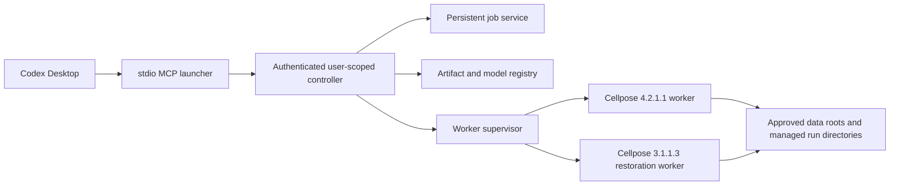

# Cellpose MCP Local-First Product Design

**Status:** Approved

**Date:** 2026-07-16

**Initial platform:** macOS 14 or later on Apple Silicon

**Initial client:** Codex Desktop

**Target release:** `0.2.0`

## 1. Summary

Cellpose MCP will become a local-first, chat-driven Cellpose product for people
who do not write code. Codex Desktop will expose a single coherent MCP tool
surface backed by a persistent local controller. The controller will supervise
two isolated, version-locked workers:

- Cellpose `4.2.1.1` for current segmentation, analysis, and fine-tuning.
- Cellpose `3.1.1.3` for legacy image restoration.

The product will ship only capabilities that have complete feature-to-test
traceability and real runtime evidence. Failure of a release-blocking core
capability blocks `0.2.0`; changing that core requires a new approved design.
Optional DINO or Zarr capabilities that cannot meet the same gate remain
unregistered and undocumented as callable. Hosting, napari, other AI clients,
Intel Macs, Windows, and Linux are explicitly deferred.

This design replaces the current compatibility-by-guessing approach. In
particular, it removes false Cellpose 4 model selection, fake diameter
estimation, unverified restoration, no-op public parameters, and documentation
claims that do not match the published package.

## 2. Confirmed Product Decisions

1. Processing is local-first. Hosted processing is a separate future product.
2. The stable local release waits for both the current Cellpose 4 worker and
   the isolated Cellpose 3 restoration worker to pass their release gates.
3. The experience is chat-first. Napari is optional and deferred.
4. MCP is the canonical assistant interface.
5. A setup and diagnostics CLI supports installation and reproducibility; it
   is not a separate AI agent.
6. A Codex skill teaches safe workflows but contains no Cellpose
   implementation.
7. Codex Desktop is the only initial supported AI client.
8. macOS 14 or later on Apple Silicon is the only initial supported platform.
9. Users approve data folders, inputs are immutable, and outputs are
   non-destructive.
10. A shared authenticated local controller owns jobs, models, and artifacts.
11. Current supported user workflows are in scope; private internals,
    arbitrary code execution, arbitrary package installation, GUI remote
    control, and research-only checkpoints are out of scope.
12. DINO is opt-in and requires both test evidence and explicit license
    acceptance.
13. Large-data/Zarr support is optional and ships only if its full integration
    gate passes.
14. There is no telemetry.
15. `0.2.0` is an intentional pre-1.0 breaking release.
16. The final verified artifacts are published to both GitHub and PyPI.

## 3. Goals

### 3.1 User Goals

A non-coding user can:

- Install and connect Cellpose to Codex without editing Python environments or
  MCP configuration files manually.
- Approve one or more microscopy data folders.
- Ask Codex to inspect, segment, refine, measure, evaluate, restore, train, and
  export through natural language.
- Understand important choices, warnings, progress, failures, and generated
  outputs in plain language.
- Restart Codex without losing a long-running job.
- Trust that original images will not be modified or silently overwritten.
- Audit every result and perform a best-effort rerun from a complete
  provenance manifest. Exact pixel identity is promised only for workflows
  whose locked runtime and device tests prove determinism.

### 3.2 Engineering Goals

- Keep Cellpose 4 and Cellpose 3 dependencies completely isolated.
- Use one versioned domain contract across MCP, controller, workers, CLI, jobs,
  and artifacts.
- Cache loaded models and avoid repeated heavyweight initialization.
- Make every public feature mechanically traceable to real evidence.
- Fail safely and transparently instead of returning ordinary success-shaped
  dictionaries containing an `"error"` key.
- Test installed artifacts and real user journeys, not only mocked functions.
- Keep future napari, other-client, and hosting adapters possible without
  coupling them to Cellpose internals.

## 4. Non-Goals

The `0.2.0` release will not:

- Host microscopy data or inference remotely.
- Support ChatGPT web, Claude, Cursor, Copilot, or other assistants.
- Support Intel Macs, Windows, or Linux.
- Claim CUDA, ROCm, or Intel GPU support.
- Claim MPS support until a real Apple Silicon hardware test passes.
- Control the Cellpose GUI or napari.
- Expose a shell, Python evaluator, package installer, or raw Cellpose CLI
  string.
- Expose private Cellpose network, tensor, dynamics, tiling, or GUI helpers.
- Accept arbitrary model URLs or untrusted PyTorch checkpoints.
- Load untrusted pickled `_seg.npy` input.
- Support training from scratch.
- Preserve broken or misleading alpha APIs solely for compatibility.
- Guarantee that software can contain no undiscovered bugs. The release
  guarantee is no known correctness or security defect within the supported
  feature matrix.

## 5. Evidence from the Current Repository

The working tree contains a useful early split between core operations, MCP
registration, and CLI adapters, but it is not releasable:

- Critical source and test files are untracked.
- The dependency range `cellpose>=3.0.0` crosses incompatible major behavior.
- Cellpose 4 ignores legacy `model_type` and channel arguments used by current
  code and documentation.
- Cellpose 4 returns styles where current code reports a diameter.
- Cellpose 4 removed automatic size estimation.
- Restoration is advertised while the supported Cellpose 4 dependency cannot
  provide it.
- Batch execution is serial despite parallel wording.
- `scale_factor` and `save_flows` are no-op public parameters.
- Default output suffixes can produce lossy label masks.
- Heavy operations reinitialize models on every call.
- Broad exception handling hides transport failures.
- Most public operations have no real success-path test.
- The existing local wheel does not contain newly advertised untracked CLI and
  operation modules.
- The source distribution includes unrelated or generated assets because
  tracked-file discovery is too broad.

The implementation will preserve useful work as migration input, not as an API
or architecture constraint.

## 6. System Architecture



### 6.1 Public Distribution

There is one public Python distribution, `cellpose-mcp`. It contains:

- The lightweight controller and domain code.
- The stdio MCP launcher.
- The setup, doctor, status, stop, update, and uninstall CLI.
- CP4 and CP3 worker entry points.
- The feature manifest and Codex skill assets.

Conflicting worker dependencies are optional extras installed into separate
managed environments. The controller environment never installs both Cellpose
versions together.

### 6.2 MCP Launcher

The launcher:

- Starts quickly and does not import Cellpose.
- Connects to the user-scoped controller over a Unix domain socket.
- Starts or repairs the controller through the installed user LaunchAgent when
  it is unavailable.
- Authenticates with a per-installation random token.
- Translates MCP calls and responses without implementing domain logic.
- Keeps stdout strictly reserved for MCP protocol messages.
- Sends diagnostics and internal logs to stderr or local log files.

### 6.3 Controller

The controller is the single source of runtime state. It owns:

- Capability discovery.
- Approved-root and path enforcement.
- Input inspection and memory estimation.
- Consent records.
- Job lifecycle and persistence.
- Worker supervision.
- Model catalog and downloads.
- Artifact allocation, validation, and commit.
- Structured errors and redacted logs.

The controller does not import Cellpose. It can start even when worker
environments or model weights are absent, allowing setup and diagnostics to
explain and repair problems.

### 6.4 User-Scoped Daemon

Setup installs a user LaunchAgent labeled for Cellpose MCP. It:

- Requires no administrator privileges.
- Uses a user-owned runtime directory with mode `0700`.
- Uses a Unix socket accessible only by the user.
- Stores a random authentication token in a file with mode `0600`.
- Restarts after an unexpected controller crash.
- Remains alive while jobs are active.
- May stop after a configurable idle period when no job is active.

The socket path is resolved through a short, user-owned macOS runtime directory
and validated against Unix socket path-length limits. Setup refuses unsafe
ownership or permissions.

### 6.5 Worker Supervisor

The supervisor:

- Provisions and verifies locked worker environments.
- Starts each worker as a child process in its own environment.
- Performs a protocol and capability handshake.
- Keeps at most the configured number of workers alive.
- Reuses loaded models within a worker.
- Tracks process health, resource use, and job ownership.
- Restarts crashed workers.
- Never silently restarts a training job.

The initial concurrency policy is one GPU/MPS-capable model job at a time and a
bounded number of lightweight CPU analysis jobs. The exact bounds are derived
from inspected memory and are included in capabilities.

### 6.6 Worker Protocol

Controller-to-worker communication is a versioned JSON-RPC-style protocol over
a private bidirectional socket pair inherited when the worker starts. The
protocol does not use worker stdout because Cellpose and numerical dependencies
may print during import or execution. It carries:

- Protocol and runtime versions.
- Job and request identifiers.
- Validated settings.
- Approved input and temporary output paths.
- Progress, warnings, structured results, and structured errors.

Large arrays never cross the protocol. The controller supplies only approved
asset paths and controller-allocated temporary output directories, and
supported worker code uses only those paths. Data interchange formats are
TIFF, JSON, Zarr where enabled, and NumPy archives with
`allow_pickle=False`. Worker stdout and stderr are captured separately,
redacted, and associated with the job correlation ID.

Workers are trusted local processes running as the user. The controller passes
only validated approved paths, and supported worker code performs no general
filesystem discovery or network access, but this is not an operating-system
sandbox. Approved-root enforcement protects against accidental or
assistant-directed access; it does not claim to contain malicious upstream
code running under the user account.

The protocol has an explicit compatibility version independent of the package
version. A handshake failure disables that worker and reports
`UPSTREAM_INCOMPATIBLE`.

## 7. Runtime and Dependency Policy

### 7.1 Controller

- Target Python: 3.12.
- FastMCP: a stable 3.x release locked with hashes and an explicit upper bound.
- Cellpose is not a controller dependency.
- Runtime resolution is captured in a committed lock file.

### 7.2 Cellpose 4 Worker

- Python 3.12.
- Cellpose exactly `4.2.1.1`.
- Primary stable models: `cpsam_v2` and `cpsam`.
- `cpsam_v2` is the default.
- `cpdino` and `cpdino-vitb` are optional and absent until their dependency,
  license, model-download, inference, and artifact tests pass.
- Legacy `model_type`, `channels`, and automatic diameter estimation are not
  exposed as CP4 behavior.
- Diameter is represented as optional rescaling toward the model training
  scale.

### 7.3 Cellpose 3 Restoration Worker

- Python 3.11.
- Cellpose exactly `3.1.1.3`.
- Only documented user-facing restoration families and modes are eligible:
  denoise, deblur, upsample, and one-click restore-and-segment for validated
  cyto3, cyto2, and nuclei checkpoints.
- Research, loss-ablation, anisotropic research, and undocumented checkpoint
  variants are excluded.
- CP3 segmentation is used only where required by the validated restoration
  workflow; it is not presented as the current segmentation runtime.

### 7.4 Locking and Upgrades

- Worker lock files include hashes.
- No floating `cellpose>=3` dependency is allowed.
- Upstream upgrades begin with signature and contract tests in a separate
  change.
- A worker version changes only after its complete feature suite passes.
- Model weights are not bundled in wheels.
- Downloads are staged, checksummed, and atomically installed after consent.

## 8. Domain Model

### 8.1 Stable Identifiers

The system uses opaque identifiers:

- `root_id` for an approved data root.
- `asset_id` for an inspected input.
- `job_id` for asynchronous work.
- `run_id` for a reproducible execution.
- `artifact_id` for an output.
- `model_id` for a verified built-in, downloaded, or trained model.

User-visible responses include friendly names and relative display paths, not
unnecessary absolute paths.

### 8.2 Strict Requests

Requests:

- Reject unknown fields.
- Use enums for runtime, model, segmentation mode, restoration mode, export
  format, and device policy.
- Use bounded numeric fields.
- Represent normalization, tiling, mask reconstruction, 3D, and resource
  settings as nested validated objects.
- Record defaults after resolution, not only values supplied by the caller.

### 8.3 Input Axes

Supported normalized layouts are explicit:

- 2D grayscale: `YX`.
- 2D multichannel: `YXC` or `CYX`.
- 3D grayscale: `ZYX`.
- 3D multichannel: `ZYXC` or `ZCYX`.

OME metadata is used when present. An ambiguous three-dimensional array is not
guessed to be RGB or a Z stack. Inspection returns
`AXIS_CONFIRMATION_REQUIRED` with the viable interpretations.

CP4 channel selection is preprocessing. The tool may select or combine up to
three approved channels before inference, but it does not pass obsolete
`chan`, `chan2`, or `channels` semantics to CP4.

## 9. MCP Surface

The following 13 workflow-level tools are release-blocking core surface. If any
tool or its required modes cannot pass the complete release gate, `0.2.0` does
not ship. DINO and Zarr are optional enum/model expansions inside existing
tools and do not change the core tool count.

| Tool | Runtime | Behavior |
| --- | --- | --- |
| `get_capabilities` | Controller | Returns versions, devices, limits, approved roots, feature status, and runtime health |
| `inspect_image` | Controller | Registers validated asset metadata, axes, dtype, dimensions, estimated memory, hash, and warnings |
| `list_models` | Controller | Returns verified built-in, downloaded, and trained models plus availability and license state |
| `prepare_model` | Controller/worker | Verifies recorded consent, checks disk and license state, downloads, verifies, and registers |
| `segment` | CP4 | Starts single, batch, 2D, orthoplane 3D, slice-stitch, or test-gated Zarr segmentation |
| `refine_segmentation` | CP4 | Rebuilds masks from cached flows and cell probability without network inference |
| `measure_masks` | Controller/CP4 | Computes validated geometry and mask statistics |
| `evaluate_segmentation` | CP4 | Computes AP, IoU-derived metrics, AJI, boundaries, and TP/FP/FN |
| `export_segmentation` | Controller/CP4 | Creates only requested, tested output formats |
| `train_model` | CP4 | Starts validated, bounded CPSAM fine-tuning |
| `restore_image` | CP3 | Starts denoise, deblur, upsample, or restore-and-segment |
| `get_job` | Controller | Returns state, progress, warnings, error, logs, result manifest, and preview handles |
| `cancel_job` | Controller | Requests cooperative cancellation and escalates safely if required |

### 9.1 Administrative Boundaries

These actions are CLI-only:

- Approve or revoke data roots.
- Import an explicitly trusted external local checkpoint.
- Remove a model.
- Repair or recreate worker environments.
- Change resource limits.
- Install or uninstall the daemon.

This prevents an assistant from silently expanding its own authority.

### 9.2 Tool Annotations

Every tool has accurate MCP annotations:

- Read-only hints for capability, model listing, job status, measurement, and
  evaluation when they do not persist new outputs.
- `inspect_image` is non-destructive but state-changing because it registers an
  asset ID and metadata.
- Open-world hints for model downloads.
- Destructive hints for cancellation and administrative actions where
  applicable.
- Explicit write behavior for segmentation, restoration, training, and export.

Server instructions summarize inspection-first behavior, approved-root rules,
consent requirements, long-job handling, and output safety within the first
512 characters.

### 9.3 Human Consent

An assistant-supplied boolean is never treated as human consent. Downloads,
license acceptance, and training require one of these verified mechanisms:

1. A Codex Desktop MCP elicitation or host approval flow that displays the
   exact action, model, source, size, license, and destination and returns a
   controller-verifiable short-lived nonce.
2. A consent record created by the guided setup or an explicit CLI command.

The Codex Desktop mechanism must pass a real client test before it is enabled.
If the tested Codex version cannot provide verifiable elicitation, the MCP tool
returns `LICENSE_ACCEPTANCE_REQUIRED` or `CONSENT_REQUIRED` before creating a
job and directs the user to the guided CLI. Setup or the CLI records consent;
the user then retries the original request. There is no indefinitely waiting
consent job. `prepare_model` and `train_model` cannot bypass this requirement.

## 10. Job Lifecycle

### 10.1 State Machine

Jobs transition transactionally:

| Current state | Allowed next states |
| --- | --- |
| `CREATED` | `VALIDATING`, `CANCELLED` |
| `VALIDATING` | `QUEUED`, `FAILED`, `CANCELLED` |
| `QUEUED` | `RUNNING`, `FAILED`, `CANCELLED` |
| `RUNNING` | `COMMITTING`, `FAILED`, `CANCELLING` |
| `CANCELLING` | `CANCELLED`, `FAILED` |
| `COMMITTING` | `SUCCEEDED`, `FAILED` |
| `SUCCEEDED` | none |
| `FAILED` | none |
| `CANCELLED` | none |

Consent is validated before `CREATED`; a missing consent record rejects the
request without creating a job. Invalid transitions are rejected. Terminal
states are immutable except for explicit archival metadata.

### 10.2 Persistence

SQLite in WAL mode stores:

- Jobs and state transitions.
- Sanitized requests.
- Runtime and worker ownership.
- Approved roots.
- Registered asset metadata and content hashes.
- Consent records.
- Model registry metadata.
- Artifact registry metadata.
- Result manifest references.
- Redacted error summaries.

The database stores no image pixel data.

Codex Desktop may restart without affecting the controller or its workers. A
controller crash is handled differently: each worker receives a parent-liveness
channel and exits when that channel closes. On controller startup:

- `CREATED` or `VALIDATING` jobs become `FAILED` with
  `CONTROLLER_RESTARTED`.
- `QUEUED` jobs remain queued because computation has not started.
- `RUNNING` or `CANCELLING` jobs become `FAILED` with `WORKER_LOST`.
- `COMMITTING` jobs follow the artifact reconciliation procedure.
- Terminal jobs remain unchanged.

Temporary outputs from lost workers are quarantined and never presented as
successful. The controller does not claim that computation survived its own
crash and never silently resubmits started work.

### 10.3 Cancellation

Cancellation:

1. Moves `CREATED`, `VALIDATING`, or `QUEUED` directly to `CANCELLED`.
2. Moves `RUNNING` to `CANCELLING`.
3. Sends a cooperative cancellation request.
4. Waits a bounded grace interval.
5. Terminates the worker if it does not stop.
6. Replaces the terminated worker.
7. Removes or quarantines uncommitted outputs.
8. Marks the job `CANCELLED`.

`COMMITTING` cannot be cancelled because the controller is reconciling a
durable result. Cancellation of a terminal or committing job returns
`JOB_NOT_CANCELLABLE` without changing state.

Training outputs are registered only after successful validation and atomic
commit.

### 10.4 Retry

- Idempotent image inspection and asset upsert may retry transient I/O once.
- Inference may retry once only when it is idempotent and no output has been
  committed.
- Training, model import, model removal, and cancellation never retry
  silently.
- Worker crashes always produce a visible structured warning or error.

## 11. Artifacts and Provenance

### 11.1 Run Directory

Each execution writes beneath:

```text
<approved-root>/cellpose-results/<run-id>/
```

Inputs remain outside the run directory and are never modified.

### 11.2 Default Artifacts

Every successful segmentation produces:

- Lossless TIFF label masks with a dtype capable of representing all labels.
- PNG preview or overlay.
- JSON provenance manifest.
- Compact JSON summary.

Optional artifacts ship only after individual round-trip tests:

- Flow and cell-probability arrays stored without pickle.
- Outline images and coordinate exports.
- ImageJ ROI ZIP.
- `_seg.npy` output created by this product.
- Plots.
- Restored images.
- Training loss history and trained model metadata.

JPEG is permitted as an input but never as a label-mask output.

### 11.3 Atomic Commit

Workers write into a controller-created temporary run directory. The controller:

1. Validates expected artifacts.
2. Reopens and validates file formats.
3. Computes hashes.
4. Writes the final manifest and a commit-ready marker containing the job ID,
   run ID, final path, and manifest hash.
5. Flushes and fsyncs files and the temporary directory.
6. In one SQLite transaction, moves the job to `COMMITTING` and records the
   temporary path, final path, and manifest hash.
7. Atomically renames the run directory into place and fsyncs its parent.
8. In a second SQLite transaction, registers artifacts and moves the job to
   `SUCCEEDED`.

Startup reconciliation handles a crash between the filesystem and database
commits:

- A valid final directory with the recorded manifest hash completes artifact
  registration and marks the job `SUCCEEDED`.
- A valid temporary directory retries the atomic rename and registration.
- Missing or hash-mismatched data marks the job `FAILED` and is quarantined.
- An unregistered final directory is never exposed as a successful result and
  is reconciled by its commit marker or quarantined.

Failed or cancelled jobs cannot leave success-shaped partial results.

### 11.4 Provenance Manifest

The manifest records:

- Product, controller, protocol, Python, Cellpose, and worker versions.
- Release artifact hash, source commit, and complete dependency-lock digest.
- macOS version, machine architecture, CPU/GPU/MPS identity, memory, and
  relevant numerical-library versions.
- Model ID, source, checksum, and accepted license state.
- Input display name, relative location, size, metadata, and content hash.
- Resolved axes and preprocessing.
- Complete effective parameters.
- Random seeds, determinism flags, thread settings, and relevant environment
  variables.
- Device and resource policy.
- Start, completion, and duration timestamps.
- Artifact names, roles, formats, shapes, dtypes, sizes, and hashes.
- Warnings.
- Measurements or evaluation results.
- Parent run IDs for refinement or derived exports.

Each manifest classifies rerun expectations as `exact`, `semantic`, or
`best_effort`. Pure metrics and format conversions can require exact results.
Neural inference is compared through documented semantic tolerances on the
same locked stack. MPS inference and training are never promised to be
bit-for-bit reproducible; their manifest states the tested tolerance and
remaining nondeterminism.

## 12. File, Model, and Resource Safety

### 12.1 Approved Roots

- Setup or an explicit CLI command approves roots.
- Approval resolves a canonical path and records device/inode information where
  practical.
- Every read and write revalidates containment.
- Symlink traversal outside the root is rejected.
- Output allocation rejects existing paths.
- The controller performs the final artifact commit.

### 12.2 Input Validation

Before a worker starts, the controller validates:

- Format and extension agreement.
- Decoded dimensions and dtype.
- Axis interpretation.
- Channel count.
- File and decoded-size limits.
- Estimated CPU/GPU memory.
- Free output disk space.
- Batch uniqueness and output-name collisions.
- Training image/mask pairing and label validity.

Optional ND2, NRRD, OME-Zarr, or other formats are absent unless their
dependency and round-trip test gates pass.

### 12.3 Model Safety

- Built-ins come from a curated catalog.
- Downloads use approved upstream URLs embedded in the release.
- Model weights are hashed and immutable after registration.
- Arbitrary URLs are rejected.
- External local checkpoints are treated as executable trusted input because
  PyTorch checkpoint loading may execute serialized code. Import requires an
  explicit CLI workflow, an approved path, display of the exact file and hash,
  a plain-language code-execution warning, and user confirmation bound to that
  hash. Validation runs in a disposable worker environment but is not described
  as a security sandbox.
- The product never imports a checkpoint supplied only by an assistant or
  downloaded from an arbitrary URL.
- The assistant cannot import or remove a model.
- DINO installation and download require explicit license acceptance.
- Trained models are registered only after load-and-infer validation.

### 12.4 Resource Limits

Limits cover:

- Input dimensions and voxels.
- Decoded bytes.
- Batch image count.
- Tile and overlap settings.
- Iterations.
- Training epochs and batch size.
- Concurrent jobs.
- Worker memory.
- Job duration.
- Result storage.

Capabilities return the active limits so Codex can explain them.

## 13. Error Model and Observability

### 13.1 Structured Errors

The public error taxonomy includes:

- `INVALID_INPUT`
- `UNSUPPORTED_FORMAT`
- `AXIS_CONFIRMATION_REQUIRED`
- `OUTSIDE_APPROVED_ROOT`
- `OUTPUT_COLLISION`
- `MODEL_UNAVAILABLE`
- `LICENSE_ACCEPTANCE_REQUIRED`
- `CONSENT_REQUIRED`
- `INSUFFICIENT_DISK`
- `INSUFFICIENT_MEMORY`
- `RESOURCE_LIMIT_EXCEEDED`
- `CONTROLLER_RESTARTED`
- `WORKER_UNAVAILABLE`
- `WORKER_CRASHED`
- `WORKER_LOST`
- `JOB_NOT_CANCELLABLE`
- `UPSTREAM_INCOMPATIBLE`
- `ARTIFACT_WRITE_FAILED`
- `CANCELLED`
- `INTERNAL_ERROR`

Each error contains:

- Stable code.
- Plain-language message.
- Whether retry is safe.
- Suggested user action.
- Job or correlation ID.
- Sanitized details.

MCP failures are reported as failures, not ordinary successful tool results.

### 13.2 Logging

- Logs are local only.
- No telemetry is emitted.
- Image contents are never logged.
- Absolute paths are redacted to root and relative display names.
- Tokens and secrets are always redacted.
- Worker stdout and stderr are captured as redacted diagnostics and are never
  interpreted as protocol messages.
- Logs include correlation IDs and state transitions.
- `doctor --export` creates an explicitly requested redacted diagnostic bundle.

## 14. Installation and Codex Experience

### 14.1 Setup Contract

The first release uses one copy-and-paste bootstrap entry point followed by a
guided setup. Users do not edit Python environments, LaunchAgents, or Codex
TOML manually. The versioned release bootstrap installs uv when absent,
verifies the downloaded bootstrap artifact against the release checksum, and
then runs:

```text
uvx --from cellpose-mcp==0.2.0 cellpose-mcp setup codex
```

The complete bootstrap command is generated from the immutable release
artifact and checksum and is itself exercised during release-candidate
acceptance. Downloading an unverified shell script is not a supported install
path. Release-candidate acceptance substitutes the exact candidate version,
such as `0.2.0rc1`, and installs the candidate artifact from TestPyPI or the
locally built wheel under test.

`uvx` is only the bootstrap process. Setup persistently installs the exact same
package version beneath:

```text
~/Library/Application Support/cellpose-mcp/
  bin/
  controller/versions/<version>/
  controller/current
  workers/cp4/<lock-digest>/
  workers/cp3/<lock-digest>/
  state/
  models/
  logs/
```

The `current` controller reference is switched atomically only after health
checks pass. Codex and the LaunchAgent use absolute paths beneath this managed
location. Setup may create a user-owned `~/.local/bin/cellpose-mcp` link only
when that directory is already usable; otherwise diagnostics display the full
quoted command path. No later command depends on an ephemeral uvx environment.

The primary commands are:

```text
cellpose-mcp setup codex
cellpose-mcp doctor
cellpose-mcp status
cellpose-mcp stop
cellpose-mcp update
cellpose-mcp uninstall
```

### 14.2 Setup Steps

Setup:

1. Verifies Apple Silicon and macOS 14 or later.
2. Checks disk, memory, CPU, and MPS availability.
3. Explains the controller, worker environments, model sizes, privacy policy,
   and result location.
4. Obtains model-download and license consent.
5. Guides the user to approve data folders.
6. Creates locked controller, CP4, and CP3 environments with uv.
7. Installs the persistent controller executable and worker environments in
   versioned managed paths.
8. Installs and starts the user LaunchAgent.
9. Backs up and parses Codex configuration.
10. Adds the absolute stdio MCP launcher path without disturbing unrelated
    configuration.
11. Installs the Codex skill.
12. Performs a controller handshake.
13. Performs worker handshakes.
14. Runs a small real local smoke workflow.
15. Displays a plain-language success or repair report.

### 14.3 Configuration Safety

- Dry-run output is available.
- Existing configuration is parsed, not modified by line-oriented string
  surgery.
- Malformed configuration stops setup without overwriting anything.
- Writes use a temporary file, validation, fsync, and atomic rename.
- A timestamped backup is retained.
- Repeated setup is idempotent.
- Uninstall removes only entries owned by Cellpose MCP.

### 14.4 Doctor

Doctor verifies:

- Architecture and OS.
- Controller and worker environment integrity.
- Protocol versions.
- LaunchAgent state.
- Socket ownership and permissions.
- Token permissions.
- Codex configuration.
- Skill installation.
- Approved roots.
- Free disk and memory.
- Model catalog, checksums, and license state.
- CPU and MPS health.
- A no-model protocol smoke.
- An optional real inference smoke.

## 15. Codex Skill

The installed Codex skill:

- Describes when Cellpose is appropriate.
- Requires `inspect_image` before inference.
- Teaches 2D, orthoplane 3D, and slice-stitch differences.
- Explains CP4 diameter as optional rescaling, not estimation.
- Uses `cpsam_v2` by default.
- Requires explicit confirmation for downloads, DINO, training, or
  administrative changes.
- Requires job polling and final manifest review.
- Encourages preview and measurement before declaring success.
- Never instructs Codex to invoke Python, shell, or private worker APIs.
- Directs Codex to report warnings and unsupported capabilities honestly.

The skill is a workflow layer. All authority and validation remain in the MCP
server.

## 16. Feature Manifest and Shipping Gate

### 16.1 Source of Truth

`src/cellpose_mcp/features.toml` is the machine-readable source of truth. Each
stable feature records:

- Feature ID and user-facing name.
- Tool and operation.
- Runtime and dependency lock.
- Supported mode, model, format, device, and platform.
- Documentation anchor.
- Unit test identifiers.
- Contract test identifiers.
- Real integration test identifiers.
- MCP test identifiers.
- Installed-package test identifiers.
- User-journey evidence.
- Security considerations.

Documentation and capability output are checked against this manifest.

### 16.2 Shipping Rule

A release contains no experimental public feature. A feature ships only when:

1. Its implementation is reachable through the supported user workflow.
2. Every manifest evidence field resolves to a passing test or recorded manual
   acceptance where automation is impossible.
3. Its documentation matches the effective schema.
4. Its dependencies and licenses are reviewed.
5. It has no known correctness or security defect.

All 13 tools and their core modes in Section 9 are release-blocking. Failure of
one blocks `0.2.0`; the implementation cannot quietly delete it to make the
release pass. Optional DINO and Zarr features are entirely absent from the
registered surface unless they pass the same gate.

When an optional capability is absent, schemas exclude its enum values and
documentation does not present it as callable. `get_capabilities` may explain
that the release does not support it, but no request can select an unavailable
mode or model.

## 17. Testing Strategy

### 17.1 Unit and Boundary Tests

Every request, result, error, state transition, path rule, artifact rule, model
rule, and consent rule has success, failure, and boundary tests.

Tests cover:

- Strict schema validation and unknown fields.
- Numeric limits and invalid combinations.
- Axis normalization.
- RGB-versus-volume ambiguity.
- Path traversal, symlinks, and collisions.
- Atomic artifact commit and rollback.
- Job state transitions.
- Cancellation escalation.
- Redaction.
- Configuration merge, backup, rollback, and idempotency.

### 17.2 Property and Fuzz Tests

Generated tests cover:

- Array ranks, shapes, axes, channel locations, dtypes, and empty dimensions.
- Malformed and adversarial file names.
- Root containment and symlink layouts.
- Invalid image headers and decompression-size declarations.
- Malformed JSON/TOML and unexpected MCP arguments.
- Mask labels, empty masks, large labels, and disconnected regions.

### 17.3 Upstream Contract Tests

Pinned-runtime tests verify:

- Constructor and evaluation signatures.
- Exact return tuple structure.
- Model selection behavior.
- CP4 removal or inertness of legacy arguments.
- CP4 absence of size estimation and restoration.
- CP3 restoration constructors and output structure.
- Training return values and saved model layout.
- Metrics and export call contracts.

These tests intentionally fail when upstream behavior changes.

### 17.4 Real CP4 Tests

Real model tests cover:

- 2D grayscale and multichannel segmentation.
- Explicit preprocessing and channel selection.
- Diameter unset and positive rescaling.
- Threshold and size controls.
- Orthoplane 3D with anisotropy and smoothing.
- Slice-stitch segmentation.
- Batch execution and same-stem collision prevention.
- Flow caching and refinement without repeated network inference.
- Measurements.
- Exact metrics on known masks.
- Every enabled export format and reopen.
- CPU execution.
- MPS execution before MPS is advertised.
- CPSAM training, saved model validation, registration, and inference with the
  produced model.

Integration correctness uses semantic invariants and metric thresholds rather
than brittle byte-for-byte mask hashes.

### 17.5 Real CP3 Tests

Every registered restoration combination has a real success-path test:

- Denoise.
- Deblur.
- Upsample.
- One-click restore-and-segment.
- CPU execution.
- MPS only if the pinned stack is proven compatible.
- Output shape, dtype, reopen, manifest, and expected segmentation invariants.

A compatibility-error test is not accepted as feature evidence.

### 17.6 Protocol and Controller Tests

- Exact tool names, schemas, annotations, and server instructions.
- FastMCP in-memory calls.
- Real stdio initialization with clean stdout.
- Authentication rejection.
- Controller restart and job persistence.
- Worker handshake mismatch.
- Worker crash and replacement.
- Inference retry rules.
- Training non-retry.
- Cooperative and forced cancellation.
- Concurrent Codex connections.
- Model reuse and cache behavior.

### 17.7 Packaging and Installation Tests

- Build sdist and wheel from a clean checkout.
- Inspect contents against an allowlist.
- Install the wheel into an empty environment.
- Provision empty CP4 and CP3 worker environments from lock files.
- Launch every installed console entry point.
- Run MCP initialization from the installed wheel.
- Run a real segmentation and restoration through the installed product.
- Test setup in an isolated temporary home.
- Test Codex TOML merge, repeat setup, malformed config, backup, rollback, and
  uninstall.
- Validate the LaunchAgent plist and lifecycle on Apple Silicon macOS.

### 17.8 Security and Supply Chain Tests

- Static security scan.
- Dependency vulnerability scan.
- Secret scan.
- Unsafe pickle rejection.
- Path traversal and symlink-race tests.
- Archive and decompression bomb limits.
- Socket and token permission tests.
- Malicious worker message tests.
- Malformed config preservation.
- Dependency license inventory.
- Wheel and sdist content audit.

### 17.9 User-Journey Test

Before release, a fresh Codex Desktop setup must complete:

1. Installation and setup.
2. Data-root approval.
3. Image inspection.
4. Model consent and preparation.
5. 2D segmentation.
6. Preview and measurements.
7. Refinement.
8. Export.
9. Job restart persistence.
10. CP3 restoration.
11. Small training run and inference with the trained model.
12. Doctor.
13. Uninstall or rollback.

Each step records the package version, environment, result, and evidence.

### 17.10 Coverage Policy

- The feature manifest must have 100% evidence coverage.
- Critical path-policy, artifact-commit, authentication, and job-state branches
  must have 100% branch coverage.
- Application code targets at least 90% branch coverage.
- Coverage never substitutes for real-runtime, protocol, packaging, or
  user-journey evidence.

## 18. Cleanup and Migration

### 18.1 Dirty-Tree Preservation

Before cleanup:

- Record tracked, modified, and untracked paths with sizes and hashes.
- Preserve critical untracked source and tests as migration inputs.
- Never use `git clean`, destructive reset, or broad deletion.
- Move uncertain experiments into an ignored `local_archive/`.
- Present the final deletion list before deleting non-reproducible user data.

### 18.2 Repository Cleanup

Candidates for removal or archival include:

- Generated mask and comparison outputs.
- Parameter sweeps and the `untitled folder`.
- Locally trained model weights and training fixtures not selected as licensed
  tests.
- Standalone untested scripts.
- Old build and distribution artifacts.
- Hardcoded personal `.mcp.json`.
- Stale generated version files.
- Obsolete tests that encode incorrect upstream behavior.

Poster and historical documentation are retained only if accurate. Otherwise
they are regenerated or archived, not left as current product claims.

### 18.3 Packaging Cleanup

The release artifacts include only:

- Required source.
- Type information.
- Runtime metadata.
- Skill assets.
- Feature manifest.
- License and third-party notices.
- User documentation needed at install time.

Posters, demos, generated results, trained weights, workflows, personal
configuration, experiments, local archives, and development-only material are
excluded.

### 18.4 API Migration

The migration guide maps old behavior:

- `segment_cells_2d`, `segment_cells_3d`, and `segment_cells_batch` to
  `segment`.
- Restoration tools to `restore_image`.
- `save_masks` to `export_segmentation`.
- `load_image_info` to `inspect_image`.
- Training to `train_model`.

The following are removed rather than aliased:

- CP4 automatic diameter estimation.
- CP4 legacy cyto/nuclei model selection claims.
- CP4 legacy channel arguments.
- No-op `scale_factor`.
- No-op `save_flows`.
- Any unverified format or restoration checkpoint.

Existing PyPI `0.1.x` releases remain immutable. `0.2.0` documents the clean
break.

## 19. Implementation Gates

Implementation proceeds through internal gates:

1. **Repository foundation:** inventory, feature manifest, packaging boundary,
   schemas, errors, and path policy.
2. **Controller foundation:** daemon, authentication, SQLite, worker protocol,
   supervisor, stdio shim, and cancellation.
3. **CP4 inference:** current models, inspection, 2D/3D/stitch/batch, artifacts,
   and real tests.
4. **Analysis:** refinement, measurements, evaluation, and export formats.
5. **Training:** dataset validation, bounded CPSAM training, registry, and
   inference with trained output.
6. **CP3 restoration:** isolated environment and every registered restoration
   workflow.
7. **Optional capabilities:** DINO and Zarr only if their full gates pass.
8. **Codex experience:** setup, doctor, skill, migration, and truthful docs.
9. **Audit:** security, reliability, supply chain, feature traceability, and
   stale-content review.
10. **Release candidate:** fresh installation and complete user journey.

No stable public release occurs between these gates.

## 20. Release and Rollback

### 20.1 Branch and Commit Policy

- Implementation occurs on `codex/cellpose-local-first`.
- Existing unrelated worktree changes are not staged accidentally.
- Commits are grouped by coherent feature and evidence.
- Release commits contain no generated runtime state or user data.

### 20.2 Release Candidate

- CI builds versioned `0.2.0rc1` artifacts once.
- All later candidate jobs install and test those exact files by hash.
- TestPyPI validates an exact `cellpose-mcp==0.2.0rc1` installation.
- GitHub publishes `v0.2.0rc1` with checksums, feature evidence, dependency
  inventory, migration guide, and limitations.
- A clean Apple Silicon Mac installs that exact candidate and runs the complete
  user journey.

### 20.3 Final Release

The `v0.2.0` workflow builds final-version artifacts from the already accepted
release commit, then runs the complete artifact, installation, and security
gates before either publication action. The final release occurs only when:

- Every registered feature passes its gate.
- All CI and real-machine tests pass.
- There are no known correctness or security defects.
- Documentation and feature manifest agree.
- Wheel and sdist contents pass inspection.
- The release candidate migration and rollback are verified.

The same immutable final artifacts are published to GitHub and PyPI. After
publication, an external clean environment installs
`cellpose-mcp==0.2.0` from the public PyPI index and runs a protocol,
controller, CP4, and CP3 smoke test.

### 20.4 Rollback

- Setup retains the previous controller and worker environment metadata until
  the new version passes health checks.
- Failed updates restore Codex configuration, LaunchAgent state, and the
  previous controller version.
- Model caches and user results are never deleted during rollback.
- Database schema migrations are transactional and versioned.
- An incompatible database migration uses a verified backup and restore path.
- A failed post-publication PyPI smoke test yanks the affected version, marks
  the GitHub release as withdrawn, publishes a visible warning, and rolls
  documentation back to the last supported version. Published artifacts are
  never overwritten; the correction uses a new patch release.

## 21. Deferred Work

Each deferred area requires a separate design and release gate:

- Remote hosting, OAuth, quotas, tenant isolation, and uploaded assets.
- ChatGPT web or other remote assistants.
- Claude, Cursor, Copilot, and other local clients.
- Napari viewer and manual correction bridge.
- Signed double-click macOS installer.
- Intel Mac.
- Windows.
- Linux.
- CUDA and ROCm.

The local domain contracts, artifact manifests, worker protocol, and feature
manifest are designed to support future adapters without expanding current
scope.

## 22. Risks and Mitigations

| Risk | Mitigation |
| --- | --- |
| CP4 and CP3 dependency conflicts | Separate locked worker environments and protocol-only communication |
| Multi-gigabyte models | Consent, disk preflight, progress, checksums, persistent cache, no bundled weights |
| Shared daemon compromise | User-only socket, token, strict permissions, no network listener, bounded API |
| Trusted worker dependency accesses user data | Honest same-user threat boundary, controller-supplied paths, curated locked dependencies, no claim of OS sandboxing |
| Worker crash or GPU failure | Supervisor, structured failure, safe retry rules, atomic outputs |
| Long jobs lost on Codex restart | Persistent controller and SQLite job state |
| Ambiguous image axes | Inspection and explicit confirmation; no heuristic slicing |
| Untrusted masks or checkpoints | Reject pickled input and arbitrary URLs; explicit CLI import with validation |
| Trusted external checkpoint executes serialized code | Exact hash display, explicit code-execution warning and user trust confirmation; never assistant-only import |
| Docs drift | Machine-readable feature manifest checked against tools, tests, and docs |
| Mock-heavy false confidence | Real CP4/CP3, installed-artifact, and user-journey gates |
| Dirty worktree data loss | Inventory, hashes, ignored archive, narrow staging, no broad cleanup commands |
| MPS variability | CPU baseline and real-hardware gate before advertising MPS |
| DINO license and dependency | Opt-in installation, explicit acceptance, separate evidence and notices |

## 23. Definition of Done

The local-first overhaul is complete only when all of the following are true:

1. The repository contains the approved architecture and no stale public
   implementation path.
2. The feature manifest enumerates every advertised capability.
3. Every advertised capability has complete passing evidence.
4. CP4 and CP3 are isolated and locked.
5. Codex Desktop completes the full user journey on Apple Silicon macOS.
6. Original data cannot be overwritten through supported workflows.
7. Jobs persist through Codex restart and cancel safely.
8. Every output is validated and has a provenance manifest.
9. Setup, doctor, update, rollback, and uninstall are verified.
10. Wheels and source distributions contain only intended files.
11. Documentation, skill, MCP schemas, CLI, and feature manifest agree.
12. No known correctness or security defect remains in the supported matrix.
13. `v0.2.0rc1` passes clean-machine acceptance.
14. The final immutable artifacts are published to GitHub and PyPI.
15. Hosting and all deferred platforms and clients remain explicitly
    unclaimed.

## 24. Primary References

- Cellpose latest package: <https://pypi.org/project/cellpose/>
- Cellpose `4.2.1.1` release:
  <https://github.com/MouseLand/cellpose/releases/tag/v4.2.1.1>
- Cellpose `3.1.1.3` package:
  <https://pypi.org/project/cellpose/3.1.1.3/>
- Cellpose API: <https://cellpose.readthedocs.io/en/latest/api.html>
- Cellpose models: <https://cellpose.readthedocs.io/en/latest/models.html>
- Cellpose 3D: <https://cellpose.readthedocs.io/en/latest/do3d.html>
- Cellpose training: <https://cellpose.readthedocs.io/en/latest/train.html>
- Cellpose restoration: <https://cellpose.readthedocs.io/en/latest/restore.html>
- Cellpose large data:
  <https://cellpose.readthedocs.io/en/latest/distributed.html>
- Cellpose inputs: <https://cellpose.readthedocs.io/en/latest/inputs.html>
- Cellpose outputs: <https://cellpose.readthedocs.io/en/latest/outputs.html>
- Cellpose BSD license:
  <https://github.com/MouseLand/cellpose/blob/v4.2.1.1/LICENSE>
- DINOv3 license:
  <https://github.com/facebookresearch/dinov3/blob/main/LICENSE.md>
- FastMCP testing: <https://gofastmcp.com/v2/patterns/testing>
- Codex MCP: <https://learn.chatgpt.com/docs/extend/mcp>
- napari-mcp: <https://github.com/royerlab/napari-mcp>
- BioPB MCP: <https://github.com/biopb/biopb/tree/main/biopb-mcp>
