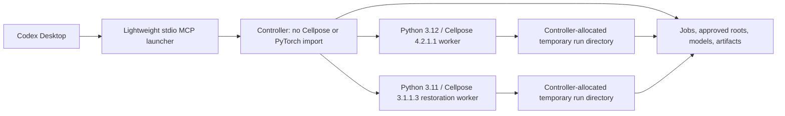

# Stable Cellpose v4 Migration Design Amendment

**Status:** Approved

**Approved:** 2026-07-21

**Date:** 2026-07-21

**Target release:** `0.2.0`

**Parent design:**
[`2026-07-16-cellpose-local-first-design.md`](./2026-07-16-cellpose-local-first-design.md)

## 1. Purpose and precedence

This amendment records the approved decision to build Cellpose MCP around the
current stable Cellpose 4 release instead of preserving the existing mixed
Cellpose 3/4 wrapper. It turns the upstream API probe results into binding
implementation and release rules.

This document supersedes only conflicting assumptions about:

- which Cellpose version owns current segmentation, analysis, and training;
- whether the existing monolithic wrapper should be repaired in place;
- whether restoration can run in the Cellpose 4 process;
- whether Cellpose belongs in the controller's dependency environment;
- what `diameter=0` or an omitted diameter means under Cellpose 4; and
- whether Phase 0 CI can treat the legacy suite as stable-product evidence.

All other product, safety, scope, 13-tool, platform, installation, testing,
cleanup, and release decisions in the parent design remain in force. If this
amendment and an older implementation plan disagree, this amendment controls
and the plan must be revised before implementation continues.

## 2. Decision summary

The product uses a new controller and versioned worker architecture alongside
the legacy code until verified replacements exist:

1. The public controller, MCP launcher, setup CLI, and domain contracts have
   no direct Cellpose or PyTorch runtime dependency.
2. Current segmentation, refinement, measurement support that needs Cellpose,
   evaluation support that needs Cellpose, export support that needs Cellpose,
   and fine-tuning run in an isolated Python 3.12 worker locked to Cellpose
   exactly `4.2.1.1`.
3. Cellpose 3 is not used as the root dependency and is not used for current
   segmentation. An isolated Python 3.11 worker locked to Cellpose exactly
   `3.1.1.3` is added later solely for validated restoration workflows.
4. The existing `tools.py`/`operations.py` compatibility wrapper is migration
   input, not the architecture to retrofit and not release evidence.
5. All 13 approved workflow tools remain release-blocking. There is no public
   CP4-only `0.2.0`; the stable release waits for the CP3 restoration worker as
   already required by the parent design.
6. Only features with complete, passing evidence are registered in the public
   release projection and documented as usable. An internal development/test
   projection may mount all 13 locked candidate tool shells with fake workers,
   but it is never release evidence. Optional capabilities are absent from
   release schemas and capability output until promoted.

The user-facing product remains a coordinated MCP + setup/doctor CLI + Codex
skill. It does not become a separate AI agent. MCP is the canonical assistant
surface, the CLI owns local administration and repair, and the skill teaches
safe workflows without implementing Cellpose.

### 2.1 Exact release surface and ownership

The requirement to make Cellpose usable by the assistant means complete
workflow coverage through these 13 safe, task-level tools and their required
modes. It does not mean exposing every private upstream function, arbitrary
Python, the raw Cellpose CLI, GUI control, or experimental checkpoint.

| Required tool | Owning boundary in this amendment |
| --- | --- |
| `get_capabilities` | Controller, with verified CP4/CP3 worker health |
| `inspect_image` | Controller inspection and approved-root service |
| `list_models` | Controller model registry |
| `prepare_model` | Controller download/consent/verification pipeline, with worker validation where needed |
| `segment` | Isolated CP4 worker |
| `refine_segmentation` | Isolated CP4 worker using product-created validated flow caches |
| `measure_masks` | Controller for independent measures; CP4 only for explicitly probed upstream-dependent measures |
| `evaluate_segmentation` | Product metric contracts with isolated CP4 helpers where explicitly used |
| `export_segmentation` | Controller-owned allocation/validation with isolated CP4 helpers where explicitly used |
| `train_model` | Isolated CP4 worker |
| `restore_image` | Isolated CP3 restoration worker only |
| `get_job` | Controller job service |
| `cancel_job` | Controller supervisor, including worker termination and replacement |

Each row remains required for `0.2.0`. Optional models, file formats, export
formats, devices, and research modes are promoted inside this surface only
after their own complete evidence gate passes.

### 2.2 Non-shrinkable required capability matrix

The schema-version-2 feature manifest must expand the 13 tools into granular,
required capability IDs. A release cannot pass by omitting a difficult mode
from registration. At minimum, the required matrix contains:

- CP4 2D grayscale and explicit multichannel preprocessing with both
  `cpsam_v2` and `cpsam`, native and positive-rescale diameter behavior,
  thresholds and size controls, and TIFF, OME-TIFF, PNG, `.jpg`, and `.jpeg`
  inputs;
- CP4 orthoplane 3D with anisotropy and smoothing, slice-stitch, and bounded
  batch execution with collision-safe outputs;
- no-forward-pass refinement evidence for every CP4 mode declared
  refinement-capable, plus the complete required measurement, evaluation,
  export, and CPSAM fine-tuning matrices from the parent roadmap;
- all 12 CP3 combinations formed by denoise, deblur, upsample, and
  restore-and-segment across the validated cyto3, cyto2, and nuclei checkpoint
  families; and
- job polling and queued/running cancellation for real segmentation, training,
  and restoration, including cleanup, worker replacement, and proof that no
  partial output became successful.

The release verifier is bidirectional: every required capability ID must be
present in the public schema and have passing evidence, and every public schema
mode/model/format/device value must map back to a stable capability record.

## 3. Meaning of “stable Cellpose”

As checked on 2026-07-21, PyPI and the upstream GitHub release page identify
Cellpose `4.2.1.1`, released 2026-06-14, as the current stable/latest release.
The CP4 worker therefore targets exactly `4.2.1.1`; it never uses a floating
specifier such as `cellpose>=3`, `cellpose>=4`, or an unpinned Git revision.

“Works with stable Cellpose” means:

- the supported runtime names the exact stable version against which every
  contract and real-model test passed;
- a newer upstream release is not silently accepted by dependency resolution;
- before a release candidate, automation checks whether PyPI has a newer
  stable version;
- adopting a newer stable version begins with isolated contract probes and
  requires the full affected feature matrix to pass again; and
- if a newer stable exists but has not passed those gates, `0.2.0` cannot claim
  support for that newer version or describe itself as supporting “any Cellpose
  4.” A user-visible limitation and an approved follow-up decision are required.

This policy gives non-coding users reproducibility while still making upstream
currency an explicit release gate rather than an accidental dependency
upgrade.

Before runtime-dependent enums freeze, Phase 1 must create durable,
machine-readable probe reports at:

- `docs/evidence/upstream/cp4-4.2.1.1-contract.json`;
- `docs/evidence/upstream/cp3-3.1.1.3-contract.json`; and
- `docs/evidence/upstream/cellpose-stable-release-check.json`.

Each contract report records the exact command, probe source hash, product
commit, Python version, lock digest, installed artifact hashes, Cellpose
version, upstream source tag/commit, timestamp, and structured observations.
The stable-release report is regenerated for the release candidate and records
the queried official sources and resolved latest stable version. These files
must be committed or bound into the immutable release-candidate evidence
bundle and referenced by the feature manifest; narrative claims alone are not
release evidence.

## 4. Verified upstream boundary

Read-only probes against the locked Cellpose `4.2.1.1` environment established
the following boundary. They are design inputs, not release evidence, until the
executable contract tests and durable report required above exist.

| Observed Cellpose 4 behavior | Binding product consequence |
| --- | --- |
| `CellposeModel.eval` returns `(masks, flows, styles)` | The adapter validates a three-item result. It never interprets `styles` as a diameter. |
| `flows` contains visualization, vector-flow, and cell-probability data | The adapter validates and names each component before artifact creation or refinement. |
| Omitted/`None` and upstream numeric zero use native model scale; a positive diameter requests rescaling | The new public contract supports explicit `native` or a positive rescale diameter. It rejects legacy zero because zero previously meant automatic sizing. |
| `models.Cellpose`, `SizeModel`, and automatic size estimation are absent | The legacy diameter-estimation tool and claims are removed rather than emulated. |
| Legacy `model_type`, `channels`, `diam_mean`, and `nchan` inputs are removed, ignored, or deprecated | They are not public CP4 parameters; channel selection is explicit preprocessing. |
| `denoise.DenoiseModel` and `CellposeDenoiseModel` are absent | Restoration cannot be imported or executed in the CP4 worker. |
| CP4 training uses `cellpose.train.train_seg(model.net, ...)` | Fine-tuning wraps this exact boundary and validates its saved output; the legacy model method is not used. |
| Training does not restore full optimizer/epoch state | Continuation means weights-based fine-tuning only and is not described as an exact training resume. |
| `train_seg` mutates the supplied network's weights and runtime state in place | Every training attempt owns a fresh, uncached, disposable worker that is retired on success, failure, or cancellation. |
| CP4 can alias and mutate module-level normalization defaults when shorthand values are passed | Every call receives a fresh, complete normalization mapping; reuse tests prove job order cannot leak settings. |
| Upstream evaluation has no reliable cooperative-cancellation hook | Long jobs run in replaceable worker processes; forced cancellation terminates the worker after a grace period. |
| Passing an upstream model name may trigger a download or fallback | Workers receive only controller-verified local model paths and have no model-download authority. |
| Upstream download behavior does not meet this product's checksum, timeout, consent, and TLS policy | The controller owns curated downloads, hash verification, staging, and atomic registration. |

The current repository contradicts this boundary: committed imports reference
removed restoration classes, legacy wrappers expose ignored parameters, and
some result handling reports a style vector as a diameter. Compatibility-error
tests or mocked success paths do not make those public features supported.

## 5. Dependency and process boundaries

### 5.1 Base distribution

The public `cellpose-mcp` wheel contains the controller, MCP launcher, CLI,
domain contracts, worker entry-point code, manifest, and skill assets. Its base
dependency set does not install Cellpose, PyTorch, restoration dependencies, or
DINO dependencies.

The wheel remains parseable and importable on Python 3.11 and 3.12 because the
same release supplies worker entry points to both managed environments. Merely
importing `cellpose_mcp`, starting the controller, running `doctor`, or
performing an MCP handshake must not import Cellpose or initialize a model.

### 5.2 Runtime locks

The CP4 and CP3 environments have independent lock files and lock digests.
Each lock includes exact transitive versions and artifact hashes. The worker
handshake reports the Python version, Cellpose version, product version,
protocol version, lock digest, device, and supported capability IDs. A mismatch
disables that worker with `UPSTREAM_INCOMPATIBLE`.

The root development lock is not the final worker lock. During repository
migration it may contain legacy dependencies needed to inspect preserved code,
but it cannot be cited as proof of controller isolation or as a release runtime.
No temporary CP3 root pin is permitted.

### 5.3 No in-process fallback

The controller never falls back to importing Cellpose when a worker is absent,
misconfigured, or crashed. CP4 never imports CP3 restoration modules, and CP3
never becomes a fallback for current segmentation. Missing runtimes produce a
structured unavailable capability or job failure, not an attempt to use a
different version.

## 6. CP4 adapter contract

The CP4 adapter is a narrow translation layer between versioned product
contracts and Cellpose `4.2.1.1`. No MCP request is passed through as arbitrary
keyword arguments.

### 6.1 Construction and model loading

- The worker constructs only the probed CP4 model class.
- The controller resolves a stable `model_id` to a verified local checkpoint
  path and expected hash before dispatch.
- The controller grants an immutable checkpoint lease from its private model
  registry. The lease pins the registry entry against replacement or deletion
  for the worker's lifetime and identifies the file by path, device/inode,
  size, and hash.
- The worker rechecks that identity immediately before load and verifies the
  loaded checkpoint/path/hash immediately after load. A missing, replaced, or
  mismatched file fails closed.
- The adapter intercepts every probed upstream cache/download entry point so it
  raises instead of accessing the network. Missing/swapped-path contract tests
  assert that no connection attempt occurs.
- Only sequential inference workers may cache loaded models, keyed by
  checkpoint hash, device, and effective runtime settings. A process has at
  most one active model job, and training never uses or enters this cache.
- Before and after sequential inference, the adapter reasserts eval mode,
  dtype, checkpoint fingerprint, and other probed mutable model invariants. If
  state cannot be reset and verified, the worker is retired instead of reused.
- Core CP4 built-ins are `cpsam_v2` (default) and `cpsam`.
- `cpdino` and `cpdino-vitb` are absent from the public schema until their
  external dependency, license, checkpoint, CPU/MPS, installed-product, and
  artifact tests pass independently.

### 6.2 Input and channel semantics

- `inspect_image` establishes explicit axes before a job can run.
- Supported normalized layouts remain `YX`, `YXC`, `CYX`, `ZYX`, `ZYXC`, and
  `ZCYX` as defined by the parent design.
- Ambiguous three-dimensional data requires user confirmation; the adapter
  does not guess RGB versus Z.
- Channel selection and combination occur as validated preprocessing. CP4 is
  given the resulting array and explicit axis metadata, not legacy `chan`,
  `chan2`, or `channels` settings.
- Every inference and training call receives a newly allocated, complete
  normalization dictionary derived from strict product settings. The adapter
  never passes a boolean or mutable shared default into CP4.
- Reuse tests alternate 2D/3D, normalization-on/off, and contrasting settings
  in both orders and compare each result with a fresh-worker control.
- Preprocessing choices and resulting shape/dtype are recorded in provenance.

### 6.3 Diameter semantics

The new public product contract represents diameter as one of:

- `native`, the default, which performs no requested diameter rescaling; or
- a bounded positive diameter in pixels, which requests CP4 rescaling relative
  to its training scale.

An omitted diameter resolves to `native`. Numeric zero is invalid in the
`0.2.0` public schema because the legacy product described zero as automatic
size estimation, a behavior CP4 cannot provide. A legacy request containing
zero fails with `INVALID_INPUT`, explains the semantic change, and asks the
user to choose native scale or a positive diameter; it is never silently
converted. There is no CP4 diameter-estimation operation, confidence value, or
inferred diameter result. Responses record the requested mode and effective
scale inputs, not `styles` or fabricated metadata.

### 6.4 Inference result validation

For every supported 2D, batch, orthoplane 3D, or slice-stitch mode, the adapter:

1. validates the upstream result arity and component types;
2. validates mask shape, integer labels, finite arrays, and input alignment;
3. identifies visualization flow, vector flow, and cell probability without
   positional ambiguity in downstream code;
4. rejects malformed or non-finite results before artifact commit;
5. stores only the validated flow data required for registered refinement
   modes, using non-pickle formats; and
6. returns a typed worker result or typed worker error, never an ordinary
   success dictionary containing an `error` key.

### 6.5 Refinement, measurement, evaluation, and export

These remain workflow-level product capabilities, not unrestricted exposure of
Cellpose internals:

- refinement rebuilds masks only from a validated cache produced by this
  product and proves that network inference was not repeated;
- measurement uses explicit mask/image contracts and independently checked
  geometry/statistics;
- evaluation defines metric names, thresholds, empty-mask behavior, and
  TP/FP/FN conventions in product contracts before calling any upstream helper;
- export writes only registered formats to controller-allocated paths and
  reopens every output for validation; and
- any mode for which exact semantics cannot be specified and tested is absent,
  even if an upstream helper function exists.

### 6.6 Fine-tuning

`train_model` supports bounded fine-tuning of a verified CPSAM checkpoint. The
adapter calls the probed `train.train_seg(model.net, ...)` API with explicit,
validated datasets and limits.

Every training attempt runs in a newly started, exclusive worker process. It
loads its own uncached base checkpoint, never shares a process with inference
or another training job, and is terminated and reaped on success, failure, or
cancellation. Validation of the produced checkpoint occurs in a different
fresh inference worker.

Acceptance requires a real training run that:

- validates image/mask pairing, axes, labels, shapes, and non-empty training
  data before worker dispatch;
- requires positive epochs, learning rate, batches, and optimizer-step count,
  and bounds epochs, batch size, image dimensions, memory, wall time, and
  output;
- records resolved training parameters, actual optimizer-step count, and
  finite loss arrays whose lengths match the probed contract;
- compares canonical parameter-tensor fingerprints before and after training
  and requires at least one trained parameter to change;
- passes a controlled small-fixture learning invariant defined by the detailed
  TDD plan, not merely checkpoint serialization;
- confirms the returned/saved model path is inside the temporary run area;
- reopens the saved checkpoint in a fresh worker;
- runs real inference with it and validates the result; and
- registers it atomically only after all checks pass.

Starting from existing verified weights is called fine-tuning or weights-based
continuation. The product does not claim training from scratch or exact resume
of optimizer, scheduler, random-generator, or epoch state.

### 6.7 Cancellation

The controller first requests cooperative cancellation through the worker
protocol. Because upstream inference and training may not observe it promptly,
every model worker holds a persisted exclusive lease for exactly one active
job. Training and inference are never colocated, so cancellation cannot kill
unrelated work.

After a bounded cooperative grace interval, the supervisor sends `TERM` to the
worker process group, waits, sends `KILL` if needed, then waits and reaps every
process. It quarantines or removes uncommitted output and marks the job
`CANCELLED` only after process-group death and reap are confirmed. A replacement
starts only after that confirmation.

If exit cannot be confirmed, the job transitions from `CANCELLING` to `FAILED`
with `WORKER_TERMINATION_UNCONFIRMED`; output remains quarantined, the exclusive
lease is retained, and the supervisor remains unhealthy and accepts no new
model job. A stubborn-process test proves a live worker can never yield
`CANCELLED`. Concurrency tests use two clients and prove cancelling one running
job leaves another queued or separately owned job intact.

## 7. CP3 restoration isolation

Cellpose 4 has no supported restoration API. The `restore_image` contract is
implemented later in the independently locked Cellpose `3.1.1.3` worker.
The CP3 constructor/return/model probe and durable report still run in Phase 1,
before restoration-specific enums freeze; only the worker implementation is
deferred.

The CP3 worker exposes only the curated restoration operations approved in the
parent design: validated denoise, deblur, upsample, and one-click
restore-and-segment combinations for eligible cyto3, cyto2, and nuclei
checkpoints. It does not expose arbitrary checkpoint names, research variants,
or the general CP3 segmentation API.

All 12 required mode/checkpoint combinations need a real CPU success-path test
with a real checkpoint and fixture. Each test must validate output shape,
dtype, finite values, reopenability, artifacts, provenance, and mode-specific
invariants. Real restoration must also prove polling, queued/running
cancellation, process cleanup, replacement, and absence of successful partial
output. A test that merely reports “restoration unavailable” is failure
evidence, not feature evidence. MPS remains absent for CP3 unless separately
proven on the supported Apple Silicon hardware.

`restore_image`, its required modes, and end-to-end installed restoration are
part of the same `0.2.0` release gate as CP4. If CP3 restoration cannot pass,
the release is blocked and a new user-approved product decision is required;
the implementation cannot silently delete restoration or publish a partial
stable release.

## 8. Model supply-chain policy

The controller owns the complete model lifecycle:

1. A packaged catalog maps a stable model ID to runtime, exact upstream source,
   license metadata, expected size, and SHA-256 digest.
2. A controller-verifiable consent record is required before network access.
3. Downloads use explicit HTTPS sources, certificate verification, bounded
   connect/read timeouts, maximum byte counts, and staged temporary files.
4. The staged file is hashed and compared with the catalog before it can be
   atomically moved into the model registry.
5. A worker receives an immutable checkpoint lease; registered files are
   rechecked before and after every first load in that process.
6. All probed upstream download/cache entry points fail closed in workers, and
   missing/swapped model tests prove zero network attempts.
7. The worker is given a verified private local path and has no download
   authority.
8. Offline reuse of an already verified model must work.

The product does not delegate security decisions to upstream auto-download
code, accept arbitrary URLs, or treat an assistant-provided confirmation flag
as human consent. Trusted local checkpoint import remains the explicit,
hash-bound, warning-bearing CLI-only exception described by the parent design.

## 9. Legacy quarantine and removal

The committed legacy server and the untracked `operations.py`/CLI experiments
currently expose a different, obsolete surface. They may be inspected for
useful ideas, but they are not promoted, packaged, or used as the base of the
new runtime.

Migration follows a strangler sequence:

1. Preserve the existing dirty-tree inventory and hashes.
   Separately inventory and hash ignored cleanup candidates; ignored never
   means disposable.
2. Build new contracts, controller modules, worker protocol, CP4 adapter, and
   canonical registrations in separate modules.
3. Keep legacy registration unavailable from the new server entry point.
4. Map each legacy behavior and test to one of: replaced by a named canonical
   capability, retained only as a private migration fixture, or removed as
   stale/misleading.
5. Delete a tracked legacy implementation, test, document, or entry-point file
   without additional user approval only when its worktree content exactly
   matches the hashed, reviewed baseline. The same bounded change records its
   disposition and proves its replacement when one is required. Any
   tracked-but-modified path instead requires the final hashed disposition list
   and explicit user approval before it is moved, modified, archived, or
   deleted.
6. Before the release candidate, remove all obsolete registrations, broad
   compatibility shims, fake diameter estimation, ignored parameters,
   success-shaped error dictionaries, stale documentation, and tests that
   assert behavior the product no longer promises.

Legacy unit tests can protect preservation work during migration, but they do
not satisfy feature-manifest evidence. Tracked-but-modified and untracked user
work remains untouched unless it is explicitly reviewed and migrated through
a later exact-path change. Before moving, modifying, archiving, or deleting any
tracked-but-modified, untracked, ignored, uncertain, generated, trained, or
otherwise potentially non-reproducible user path, the product team presents
one final disposition list with hashes and obtains explicit user approval. No
broad cleanup command is permitted.

## 10. Phase 0 and CI correction

Phase 0 is a repository-safety foundation, not a claim that the current
scientific product works. Its CI must be truthful and green on a clean clone.

The final Phase 0 CI change therefore:

- tests the committed inventory, feature-ledger, Python-policy, and packaging
  foundation on Python 3.11 and 3.12 with the locked toolchain;
- lints and type-checks only the explicitly verified foundation paths;
- keeps the bootstrap feature manifest deliberately blocked with one unresolved
  matrix blocker plus all 13 missing stable-tool blockers;
- does not collect the incompatible legacy wrapper as if it were a CP4 product
  regression suite;
- does not run or advertise a legacy installed-segmentation end-to-end job;
  and
- labels this scope as `foundation`, never as complete product CI.

This is not permission to hide failures indefinitely. Later migration changes
must either replace and test each supported behavior or remove its stale code,
test, registration, and documentation. Whole-product CI becomes mandatory only
after the canonical server exists and must be green before any stable feature
record or release artifact is accepted.

Any pending CI diff that still runs broad legacy `pytest`, claims a current
installed segmentation journey, or depends on the root environment as the CP4
worker must be revised before it is committed.

## 11. Mandatory evidence lanes

Evidence is separated so a green lightweight check cannot be mistaken for a
working scientific feature.

| Lane | Required evidence |
| --- | --- |
| Foundation | Clean-clone inventory, manifest block, Python policy, artifact allowlist, focused Ruff/mypy/pytest on 3.11 and 3.12 |
| Upstream currency/probes | Durable CP4/CP3 contract reports with commands, source/lock/artifact identities, plus a release-candidate latest-stable check against official PyPI/GitHub sources |
| Controller/domain | Strict schemas, paths, consent, jobs, persistence, artifact commit/recovery, errors, redaction, and fake-worker protocol tests without Cellpose installed |
| CP4 contract | Exact `4.2.1.1` imports, signatures, constructors, model loading, eval tuple/flow structure, removed/inert legacy behavior, training boundary, and runtime handshake |
| CP4 real CPU | Real `cpsam_v2` and `cpsam` model runs for the complete required core matrix, semantic correctness, artifacts, state-isolated reuse, refinement, metrics, export, non-no-op disposable-worker training, and exclusive cancellation |
| Installed product | Build allowlisted wheel/sdist, install into empty managed environments, run entry points, initialize MCP, and complete real segmentation/training journeys through the public surface |
| Apple Silicon | Local supported-hardware setup/doctor, CPU, MPS discovery, real MPS inference/training where advertised, cancellation, LaunchAgent, and Codex Desktop acceptance |
| CP3 contract and real | Exact `3.1.1.3` isolated handshake, all 12 required restoration combinations, polling/cancellation/cleanup/replacement, and installed restoration journey |
| Security/supply chain | Approved-root adversarial tests, model download/hash/consent/offline tests, unsafe-checkpoint rejection, permissions, malformed worker messages, scans, and dependency/license inventory |
| Release manifest | Bidirectional required-matrix/public-schema coverage, with every stable record resolving to admissible automated or narrowly allowed manual evidence for unit, contract, real-runtime, MCP, installed-package, documentation, and journey requirements |

Mocks are useful for controller failure branches but cannot prove Cellpose
scientific success. Real-model tests use small licensed fixtures and semantic
invariants rather than brittle byte-for-byte neural-output snapshots.

Release evidence has two explicit record types:

- **Automated evidence** is bound to the exact source commit, wheel/sdist
  hashes, worker lock digest, model/fixture hashes, Python and Cellpose
  versions, platform/device identity, test node ID, start/end time, and
  outcome. The verifier accepts only an executed `PASS` for every referenced
  node; skipped, xfailed, xpassed, deselected, stale, or wrong-artifact results
  do not satisfy a capability. It also checks collection counts so absence
  cannot masquerade as success.
- **Manual acceptance** is allowed only where the parent design explicitly
  says automation is impossible. It records an approved versioned procedure,
  source/artifact/lock hashes, platform/device identity, timestamp, operator,
  independent reviewer, attachments, and an `ACCEPTED` outcome. The manifest
  records why automation is impossible and the verifier rejects an unapproved
  manual substitute.

CP4/CP3 contracts, model loading, segmentation, refinement, measurements,
evaluation, export, training, restoration, cancellation, artifact validation,
and installed scientific journeys are automation-only and can never use a
manual-acceptance record as feature evidence.

## 12. Revised execution sequence and gates

The parent roadmap remains structurally valid, with these binding corrections:

1. **Finish Phase 0 truthfully.** Amend its detailed plan and CI assertions so
   only verified foundation checks run. Keep the release manifest blocked.
2. **Probe both pinned runtimes, then freeze contracts.** Convert the CP4
   observations above and the CP3 restoration boundary into executable tests
   and durable reports before any runtime-dependent enum freezes.
3. **Build the new controller/proxy spine beside legacy code.** It must start
   and pass its suite with Cellpose absent.
4. **Add the isolated CP4 lock and adapter.** Prove handshake, local-path model
   loading, correct inference parsing, native/rescale diameter semantics, and
   forced cancellation.
5. **Promote CP4 capabilities vertically.** For each required matrix entry, add contract,
   implementation, real CPU test, artifact validation, MCP registration,
   documentation, and manifest evidence atomically.
6. **Complete CP4 training and installed journeys.** A saved model must reopen
   and infer successfully before `train_model` can become stable.
7. **Add isolated CP3 restoration.** Implement the already-probed contract and
   prove all 12 required restoration combinations without weakening the CP4
   boundary.
8. **Complete setup/doctor and Codex skill.** Provision both locks and run a
   real local smoke without requiring the user to edit code or configuration.
9. **Remove quarantined legacy surface.** Use the reviewed disposition map;
   rebuild from a clean checkout and prove no stale module or claim ships.
10. **Run the complete release audit.** Regenerate the official latest-stable
    check; then all 13 tools, required matrices, macOS hardware acceptance,
    installed artifacts, security checks, GitHub release, and PyPI publication
    must satisfy the parent release procedure.

No stable feature is promoted merely because its implementation exists. A
vertical feature change is complete only when all evidence references exist
and pass. No release occurs between internal gates.

## 13. Acceptance criteria for this amendment

Implementation conforms to this amendment only when all of the following are
true:

- The base/controller package starts, initializes MCP, and runs doctor without
  Cellpose or PyTorch installed.
- The CP4 worker reports and enforces Cellpose exactly `4.2.1.1` from its own
  lock; the CP3 worker later reports exactly `3.1.1.3` from a different lock.
- Durable CP4 and CP3 probe reports exist, match their executable contracts,
  and a release-candidate official-source report confirms the supported stable
  version decision.
- No controller import reaches legacy `tools.py`, `operations.py`, Cellpose, or
  PyTorch.
- CP4 model loading uses a hash-verified local path and works offline after
  preparation; missing or swapped paths fail without any network attempt.
- CP4 inference validates `(masks, flows, styles)` and never reports `styles`
  as a diameter.
- Public CP4 requests contain no legacy model/channel/automatic-size fields,
  and numeric diameter zero is rejected with an explanatory migration error.
- Native and positive-rescale diameter behavior each have contract and real
  model evidence, and no diameter-estimation claim remains.
- Sequential inference reuse passes alternating-order normalization and
  2D/3D state-isolation tests against fresh-worker controls.
- Every required CP4 segmentation, refinement, measurement, evaluation,
  export, and fine-tuning matrix entry has real CPU evidence through the
  public workflow.
- Training uses a fresh disposable worker, performs positive optimizer steps,
  produces finite contract-shaped losses and changed parameter fingerprints,
  passes the controlled learning invariant, and reopens/infers in a separate
  fresh worker.
- Cancellation proves cleanup and worker replacement for real long-running
  inference, training, and restoration without harming another client's job;
  replacement and `CANCELLED` occur only after process-group death/reap is
  confirmed, while unconfirmed termination becomes a quarantined
  `WORKER_TERMINATION_UNCONFIRMED` failure with its lease retained.
- Restoration is available only through the isolated CP3 worker and all 12
  required mode/checkpoint combinations have real success evidence.
- The canonical MCP surface contains exactly the approved 13 tools with
  accurate schemas, annotations, instructions, and structured failures.
- Setup from a clean, allowlisted wheel/sdist provisions isolated runtimes and
  completes real segmentation and restoration journeys.
- The supported Apple Silicon/macOS and Codex Desktop acceptance journey
  passes.
- The feature manifest resolves every advertised capability to current passing
  automated evidence or explicitly permitted manual acceptance, proves
  bidirectional coverage of the non-shrinkable required matrix, and reports no
  blocker or known supported-scope defect. Scientific workflow evidence is
  automated only.
- Obsolete code, tests, entry points, docs, generated artifacts, and package
  claims are removed only after preservation review and are absent from the
  final distributions.
- No tracked-but-modified, untracked, ignored, uncertain, generated, trained,
  or potentially non-reproducible user path is modified or deleted without the
  user's explicit approval of the final hashed disposition list.

## 14. Explicitly unchanged or deferred

This amendment does not expand `0.2.0` to hosted processing, napari control,
ChatGPT web, Claude, Cursor, Copilot, Intel Mac, Windows, Linux, CUDA, arbitrary
code execution, arbitrary model URLs, DINO, or Zarr. Those remain deferred or
independently gated exactly as stated in the parent design.

It also does not promise that software can have no undiscovered bugs. It
requires no known correctness or security defect in the supported matrix and
complete evidence for every shipped feature.

## 15. Primary sources

- Cellpose PyPI release history and current stable package:
  <https://pypi.org/project/cellpose/>
- Upstream Cellpose releases (`v4.2.1.1` marked latest on 2026-07-21):
  <https://github.com/MouseLand/cellpose/releases>
- Cellpose `v4.2.1.1` source tag:
  <https://github.com/MouseLand/cellpose/tree/v4.2.1.1>
- Parent product design:
  [`2026-07-16-cellpose-local-first-design.md`](./2026-07-16-cellpose-local-first-design.md)
- Program roadmap:
  [`../plans/2026-07-16-cellpose-local-first-roadmap.md`](../plans/2026-07-16-cellpose-local-first-roadmap.md)
- Repository-foundation plan:
  [`../plans/2026-07-16-cellpose-repository-foundation.md`](../plans/2026-07-16-cellpose-repository-foundation.md)
- Bootstrap 13-tool ledger:
  [`../../../src/cellpose_mcp/features.toml`](../../../src/cellpose_mcp/features.toml)
